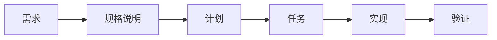
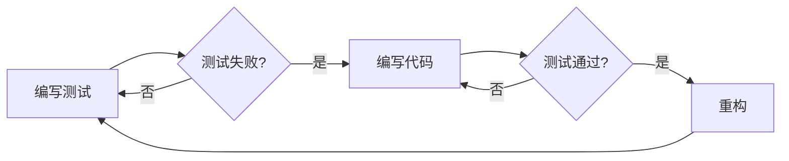
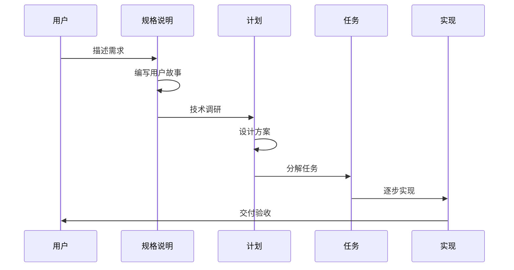

<!--
================================================================================
同步影响报告 (Sync Impact Report)
================================================================================
版本变更: 0.0.0 → 1.0.0 (初始版本)
修改的原则: 无（首次创建）
新增章节:
  - 核心原则 (5条)
  - 文档规范
  - 开发工作流
  - 治理
需要更新的模板:
  - .specify/templates/plan-template.md - ✅ 已验证兼容
  - .specify/templates/spec-template.md - ✅ 已验证兼容
  - .specify/templates/tasks-template.md - ✅ 已验证兼容
后续待办:
  - 无
================================================================================
-->

# Speckit Demo 项目宪法

## 核心原则

### 一、中文优先原则

**所有项目文档必须（MUST）优先使用中文编写。** 包括但不限于：
- 需求规格说明书（spec）
- 实施计划（plan）
- 任务清单（tasks）
- 代码注释（关键业务逻辑）
- 提交信息（commit message）

**理由**：确保团队成员无障碍理解项目文档，降低沟通成本，提高协作效率。

**例外情况**：
- 代码标识符（变量名、函数名等）使用英文
- 第三方库/框架的专有名词保留原文
- 国际化（i18n）相关内容

### 二、可视化驱动原则

**技术架构图、流程图、状态图等必须（MUST）使用 Mermaid 语法编写。**

**理由**：
- Mermaid 图表可在 Markdown 文件中直接渲染，无需额外工具
- 图表即代码，便于版本控制和评审
- 与 GitHub/GitLab/VS Code 等工具原生兼容

**适用场景**：
- 系统架构图（`graph`）
- 时序图（`sequenceDiagram`）
- 状态机（`stateDiagram`）
- 类图（`classDiagram`）
- 流程图（`flowchart`）

### 三、术语统一原则

**项目中涉及的专有术语必须（MUST）统一记录到术语表文档中。**

- 术语表路径：`.specify/memory/glossary.md`
- 新术语出现时必须及时更新术语表
- 代码中使用术语必须与术语表保持一致

**理由**：
- 消除歧义，确保团队对概念理解一致
- 便于新成员快速熟悉项目
- 提高文档和代码的可维护性

### 四、测试先行原则

**新功能开发应当（SHOULD）遵循测试驱动开发（TDD）流程：**

1. 编写测试用例
2. 确认测试失败（红色）
3. 编写最小实现代码
4. 确认测试通过（绿色）
5. 重构优化

**理由**：确保代码质量，降低回归风险，提供活文档。

### 五、简约设计原则

**系统设计必须（MUST）遵循 YAGNI（You Aren't Gonna Need It）原则：**

- 只实现当前需求，不预设未来功能
- 优先选择简单方案而非"完美"方案
- 复杂性必须有明确的业务价值支撑

**理由**：避免过度设计，减少维护负担，加快交付速度。

## 文档规范

### 文档结构

| 文档类型 | 存放路径 | 说明 |
|---------|---------|------|
| 功能规格 | `specs/[功能名]/spec.md` | 需求和验收标准 |
| 实施计划 | `specs/[功能名]/plan.md` | 技术方案和架构 |
| 任务清单 | `specs/[功能名]/tasks.md` | 具体实施任务 |
| 术语表 | `.specify/memory/glossary.md` | 项目术语定义 |
| 宪法 | `.specify/memory/constitution.md` | 本文档 |

### 命名规范

- 文件名：使用小写字母和连字符（kebab-case）
- 目录名：使用小写字母和连字符（kebab-case）
- 分支名：`[编号]-[简短描述]`，如 `001-user-authentication`

## 开发工作流

### 功能开发流程

### 代码评审要求

- 所有代码变更必须（MUST）通过 Pull Request
- PR 必须关联对应的任务编号
- 评审者必须验证代码是否符合宪法原则

## 治理

### 宪法效力

本宪法为项目最高准则，所有开发实践、文档标准、代码规范必须（MUST）遵循本宪法。如有冲突，以本宪法为准。

### 修订流程

1. 提出修订提案（说明变更内容和理由）
2. 团队评审讨论
3. 达成共识后更新宪法
4. 更新版本号和修订日期
5. 同步更新受影响的模板和文档

### 版本号规则

采用语义化版本（Semantic Versioning）：

- **MAJOR**：不兼容的治理变更（如删除或重新定义原则）
- **MINOR**：新增原则或章节
- **PATCH**：措辞修订、澄清说明、格式调整

### 合规检查

每次 PR 评审必须（MUST）验证以下事项：
- [ ] 文档使用中文编写
- [ ] 图表使用 Mermaid 语法
- [ ] 新术语已添加到术语表
- [ ] 代码变更有对应测试
- [ ] 设计符合简约原则

**版本**: 1.0.0 | **批准日期**: 2026-01-08 | **最后修订**: 2026-01-08
