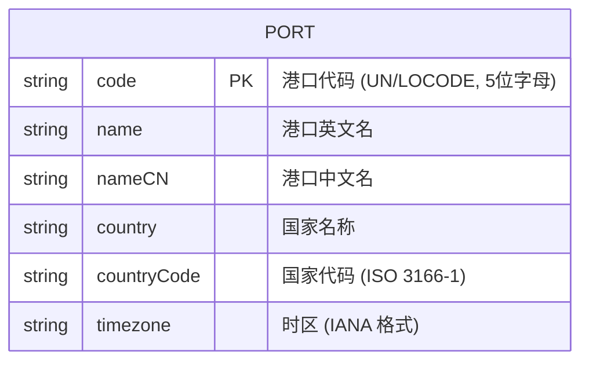
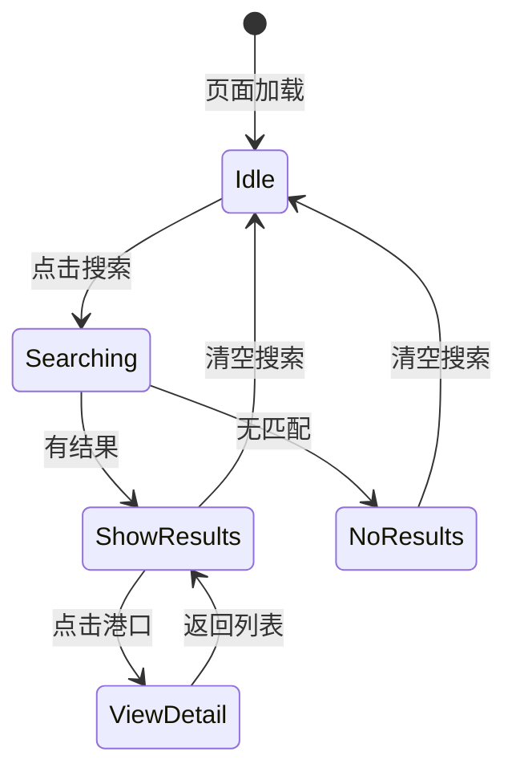

# 数据模型：全球航运港口信息查询

**功能分支**: `001-port-query`  
**创建日期**: 2026-01-08  
**状态**: 完成

## 概述

本文档定义港口查询功能的数据模型，包括实体定义、字段规范和验证规则。

---

## 实体关系图



---

## 实体详情

### Port（港口）

表示一个航运港口的完整信息。

| 字段 | 类型 | 必填 | 描述 | 示例 |
|------|------|------|------|------|
| `code` | string | ✅ | 港口代码，UN/LOCODE 格式，5位纯字母，主键 | `"CNSHA"` |
| `name` | string | ✅ | 港口英文名称 | `"Shanghai"` |
| `nameCN` | string | ✅ | 港口中文名称 | `"上海"` |
| `country` | string | ✅ | 港口所在国家名称（英文） | `"China"` |
| `countryCode` | string | ✅ | ISO 3166-1 两字母国家代码 | `"CN"` |
| `timezone` | string | ✅ | 港口所在时区，IANA 时区格式 | `"Asia/Shanghai"` |

### 字段验证规则

| 字段 | 规则 |
|------|------|
| `code` | 必须匹配正则 `/^[A-Z]{5}$/`（存储时转为大写） |
| `name` | 非空字符串，最大长度 100 |
| `nameCN` | 非空字符串，最大长度 50 |
| `country` | 非空字符串，最大长度 100 |
| `countryCode` | 必须匹配正则 `/^[A-Z]{2}$/` |
| `timezone` | 有效的 IANA 时区标识符 |

---

## TypeScript 类型定义

```typescript
/**
 * 港口实体
 * 表示一个航运港口的完整信息
 */
export interface Port {
  /** 港口代码 (UN/LOCODE, 5位字母, 如 CNSHA) */
  code: string
  
  /** 港口英文名称 */
  name: string
  
  /** 港口中文名称 */
  nameCN: string
  
  /** 港口所在国家名称 (英文) */
  country: string
  
  /** ISO 3166-1 两字母国家代码 */
  countryCode: string
  
  /** 时区 (IANA 格式, 如 Asia/Shanghai) */
  timezone: string
}

/**
 * 查询模式枚举
 */
export type SearchMode = 'exact' | 'fuzzy'

/**
 * 查询结果
 */
export interface SearchResult {
  /** 匹配的港口列表 */
  ports: Port[]
  
  /** 结果总数 */
  total: number
  
  /** 使用的查询模式 */
  mode: SearchMode
  
  /** 查询关键词 */
  query: string
}

/**
 * 分页参数
 */
export interface PaginationParams {
  /** 当前页码 (从 1 开始) */
  page: number
  
  /** 每页条数 */
  pageSize: number
}

/**
 * 分页结果
 */
export interface PaginatedResult<T> {
  /** 当前页数据 */
  items: T[]
  
  /** 当前页码 */
  currentPage: number
  
  /** 每页条数 */
  pageSize: number
  
  /** 总条数 */
  total: number
  
  /** 总页数 */
  totalPages: number
}
```

---

## 数据文件格式

### ports.json 结构

```json
{
  "ports": [
    {
      "code": "CNSHA",
      "name": "Shanghai",
      "nameCN": "上海",
      "country": "China",
      "countryCode": "CN",
      "timezone": "Asia/Shanghai"
    },
    {
      "code": "SGSIN",
      "name": "Singapore",
      "nameCN": "新加坡",
      "country": "Singapore",
      "countryCode": "SG",
      "timezone": "Asia/Singapore"
    }
  ]
}
```

### JSON Schema

```json
{
  "$schema": "http://json-schema.org/draft-07/schema#",
  "type": "object",
  "required": ["ports"],
  "properties": {
    "ports": {
      "type": "array",
      "items": {
        "type": "object",
        "required": ["code", "name", "nameCN", "country", "countryCode", "timezone"],
        "properties": {
          "code": {
            "type": "string",
            "pattern": "^[A-Z]{5}$"
          },
          "name": {
            "type": "string",
            "maxLength": 100
          },
          "nameCN": {
            "type": "string",
            "maxLength": 50
          },
          "country": {
            "type": "string",
            "maxLength": 100
          },
          "countryCode": {
            "type": "string",
            "pattern": "^[A-Z]{2}$"
          },
          "timezone": {
            "type": "string"
          }
        }
      }
    }
  }
}
```

---

## 状态流转

本功能无复杂状态机，仅有简单的 UI 状态：



---

## 索引与查询优化

由于数据量较小（<500条），采用简单的内存过滤即可：

1. **精确查询**：使用 `Array.find()` 按 code 字段查找（O(n)，n<500 可接受）
2. **模糊查询**：使用 `Array.filter()` 检查 name/nameCN 是否包含关键词（大小写不敏感）

无需额外索引结构。
