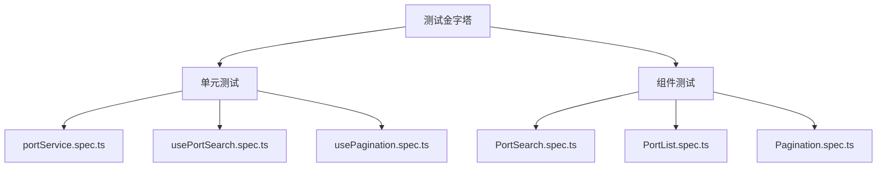

# 技术研究：全球航运港口信息查询

**功能分支**: `001-port-query`  
**创建日期**: 2026-01-08  
**状态**: 完成

## 研究概述

本文档记录 Phase 0 阶段的技术调研结果，为实施计划提供技术决策依据。

---

## 1. Vue 3 Composition API 最佳实践

### 决策
采用 Vue 3 Composition API + `<script setup>` 语法糖。

### 理由
- **更好的 TypeScript 支持**：Composition API 与 TypeScript 集成更自然，类型推断更准确
- **逻辑复用**：通过 Composables 模式复用业务逻辑（如搜索、分页），无需 mixins 或 HOC
- **更小的打包体积**：`<script setup>` 编译后代码更简洁
- **现代化开发体验**：符合当前 Vue 生态系统主流实践

### 考虑过的替代方案
| 方案 | 否决原因 |
|------|---------|
| Options API | 类型支持较弱，逻辑复用需 mixins（难以维护） |
| Class-based (vue-class-component) | 官方已弃用，Composition API 为推荐方案 |

### 实践要点
```typescript
// 推荐的 Composable 结构
export function usePortSearch() {
  const query = ref('')
  const results = ref<Port[]>([])
  const isLoading = ref(false)
  
  const search = async () => { /* ... */ }
  
  return { query, results, isLoading, search }
}
```

---

## 2. 前端分页实现策略

### 决策
采用纯前端分页（Client-side Pagination），一次加载全部数据后在前端进行切片展示。

### 理由
- **数据规模适配**：预计 ~500 港口数据，JSON 文件约 50KB，一次加载无性能问题
- **离线可用**：符合 SC-005 要求，首次加载后可离线使用
- **实现简单**：无需后端支持，前端计算分页即可
- **用户体验**：翻页即时响应，无网络延迟

### 考虑过的替代方案
| 方案 | 否决原因 |
|------|---------|
| 后端分页 | 需求明确无后端，增加不必要复杂性 |
| 虚拟滚动 | 数据量小（<500条），分页更符合用户习惯 |
| 无限滚动 | 不适合精确查找场景，用户需要快速定位 |

### 实践要点
```typescript
// usePagination Composable
export function usePagination<T>(items: Ref<T[]>, pageSize = 10) {
  const currentPage = ref(1)
  const totalPages = computed(() => Math.ceil(items.value.length / pageSize))
  const paginatedItems = computed(() => {
    const start = (currentPage.value - 1) * pageSize
    return items.value.slice(start, start + pageSize)
  })
  
  return { currentPage, totalPages, paginatedItems }
}
```

---

## 3. 查询模式自动判断逻辑

### 决策
根据输入字符串格式自动判断查询模式：5位纯字母 → 精确查询，其他 → 模糊查询。

### 理由
- **用户友好**：用户无需手动选择查询模式，系统自动识别
- **符合业务规则**：UN/LOCODE 港口代码固定为 5 位纯字母格式
- **实现简洁**：正则表达式 `/^[A-Za-z]{5}$/` 即可判断

### 实现逻辑
```mermaid
flowchart TD
    A[用户输入查询字符串] --> B{匹配 /^[A-Za-z]{5}$/}
    B -->|是| C[精确查询：按港口代码匹配]
    B -->|否| D[模糊查询：按名称包含匹配]
    C --> E[返回单个结果或空]
    D --> F[返回匹配列表]
```

### 实践要点
```typescript
function determineSearchMode(query: string): 'exact' | 'fuzzy' {
  const portCodePattern = /^[A-Za-z]{5}$/
  return portCodePattern.test(query) ? 'exact' : 'fuzzy'
}
```

---

## 4. JSON 数据加载策略

### 决策
使用 Vite 的静态资源导入功能，将 JSON 文件作为模块导入。

### 理由
- **构建时优化**：Vite 会在构建时处理 JSON，支持 Tree-shaking
- **类型安全**：可为 JSON 数据定义 TypeScript 类型
- **开发体验**：热更新支持，修改 JSON 立即生效

### 考虑过的替代方案
| 方案 | 否决原因 |
|------|---------|
| fetch() 动态加载 | 需要额外的加载状态处理，增加复杂性 |
| localStorage 缓存 | 数据量小，无需持久化缓存 |
| IndexedDB | 过度设计，不符合简约原则 |

### 实践要点
```typescript
// 直接导入 JSON 数据（Vite 支持）
import portsData from '@/assets/data/ports.json'

// 或使用动态导入实现懒加载
const loadPorts = async () => {
  const module = await import('@/assets/data/ports.json')
  return module.default as Port[]
}
```

---

## 5. Vitest 测试策略

### 决策
采用 Vitest 作为测试框架，配合 @vue/test-utils 进行组件测试。

### 理由
- **Vite 原生集成**：与 Vite 构建工具无缝配合，共享配置
- **快速执行**：基于 ESM，测试启动和执行速度极快
- **Jest 兼容**：API 与 Jest 兼容，降低学习成本
- **内置功能丰富**：内置 mock、coverage、watch 模式

### 测试分层


### 实践要点
```typescript
// vitest.config.ts
import { defineConfig } from 'vitest/config'
import vue from '@vitejs/plugin-vue'

export default defineConfig({
  plugins: [vue()],
  test: {
    environment: 'jsdom',
    globals: true,
    coverage: {
      reporter: ['text', 'html'],
    },
  },
})
```

---

## 6. 港口数据来源与初始化

### 决策
手动整理主流国际港口数据，以 JSON 文件形式存储。

### 理由
- **数据可控**：静态数据便于版本控制和审核
- **无外部依赖**：不依赖第三方 API，符合离线可用要求
- **符合需求**：FR-008 要求至少 20 个港口，实际提供约 30 个主流港口

### 数据来源参考
- UN/LOCODE 官方数据库
- 各主要航运公司公开港口列表

### 初始港口列表（覆盖 5 大洲）

| 大洲 | 港口示例 |
|------|---------|
| 亚洲 | CNSHA(上海), CNNKG(宁波), CNQIN(青岛), HKHKG(香港), SGSIN(新加坡), JPYOK(横滨), KRPUS(釜山) |
| 欧洲 | NLRTM(鹿特丹), DEHAM(汉堡), BEANR(安特卫普), GBFXT(费利克斯托), FRLEH(勒阿弗尔) |
| 北美 | USLAX(洛杉矶), USNYC(纽约), CAHAL(哈利法克斯), MXZLO(曼萨尼约) |
| 南美 | BRSSZ(桑托斯), CLSAI(圣安东尼奥), ARBUE(布宜诺斯艾利斯) |
| 大洋洲 | AUSYD(悉尼), AUMEL(墨尔本), NZAKL(奥克兰) |
| 非洲 | ZADUR(德班), EGPSD(塞得港), MAPTM(丹吉尔) |

---

## 总结

所有技术决策均已明确，无 NEEDS CLARIFICATION 项。可进入 Phase 1 设计阶段。
