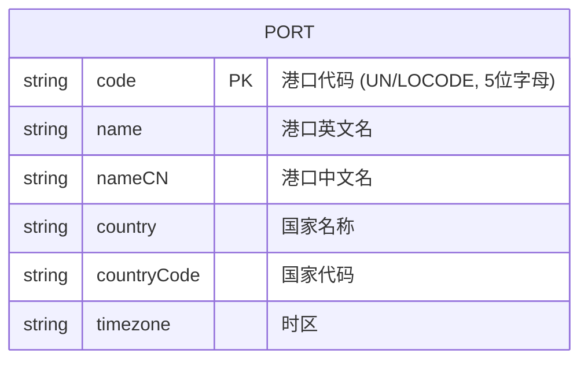

# 功能规格说明：全球航运港口信息查询

**功能分支**: `001-port-query`  
**创建日期**: 2026-01-08  
**状态**: 草稿  
**输入**: 用户描述: "创建全球航运港口信息查询页面，支持按港口代码精确查询和按港口名称模糊查询"

## 澄清事项

### 会话 2026-01-08

- Q: 当用户在搜索框中输入查询条件后，系统应如何触发搜索？ → A: 用户必须点击"搜索"按钮才触发查询。
- Q: 当页面刷新后，系统是否需要记住用户上一次的查询条件或选中的港口？ → A: 刷新后重置，不记录查询历史。
- Q: 如何区分精确查询与模糊查询？ → A: 根据输入格式自动判断：5位字母代码→精确查询，其他→模糊查询。
- Q: 港口名称字段如何支持多语言？ → A: 同时维护中英文名称（name 和 nameCN 字段）。
- Q: 查询结果如何展示？ → A: 前端分页展示，默认每页10条。

## 用户场景与测试 *(必填)*

### 用户故事 1 - 按港口代码精确查询 (优先级: P1)

作为一名物流操作员，我需要通过输入港口代码（如 CNSHA）快速查找到对应港口的详细信息，以便准确填写运输单据。

**优先级理由**: 港口代码是航运行业最常用的标识符，物流人员日常工作中频繁使用代码查询，这是核心使用场景。

**独立测试**: 可通过在搜索框输入港口代码并验证返回结果来独立测试，交付后即可用于日常港口信息查询工作。

**验收场景**:

1. **Given** 用户在查询页面，**When** 用户输入完整港口代码"CNSHA"并点击搜索，**Then** 系统自动识别为精确查询并显示上海港的详细信息
2. **Given** 用户在查询页面，**When** 用户输入不存在的港口代码"XXXXX"并搜索，**Then** 系统提示"未找到匹配的港口"
3. **Given** 用户在查询页面，**When** 用户输入港口代码时使用小写字母"cnsha"，**Then** 系统能正常识别并返回上海港信息（大小写不敏感）

---

### 用户故事 2 - 按港口名称模糊查询 (优先级: P2)

作为一名物流操作员，我需要通过输入港口名称的部分内容（如"Shanghai"或"上海"）来搜索港口，以便在不确定港口代码时也能找到所需信息。

**优先级理由**: 名称模糊查询是代码查询的重要补充，当用户不记得准确代码时提供备选查询方式。

**独立测试**: 可通过在搜索框输入港口名称关键词并验证返回结果列表来独立测试。

**验收场景**:

1. **Given** 用户在查询页面，**When** 用户输入"Shanghai"（非5位字母）并搜索，**Then** 系统自动识别为模糊查询并显示包含"Shanghai"的所有港口列表
2. **Given** 用户在查询页面，**When** 用户输入"上海"并搜索，**Then** 系统在中文名称字段中模糊匹配并显示相关港口
3. **Given** 搜索结果超过10条，**When** 用户查看结果列表，**Then** 系统分页显示，默认每页10条，并提供翻页控件

---

### 用户故事 3 - 查看港口详细信息 (优先级: P3)

作为一名物流操作员，我需要查看港口的完整详细信息（包括时区、国家等），以便进行业务决策和时间安排。

**优先级理由**: 详细信息展示是查询功能的自然延伸，提供完整的业务价值。

**独立测试**: 可通过点击任意港口查看其完整信息来独立测试。

**验收场景**:

1. **Given** 搜索结果中显示港口列表，**When** 用户点击某个港口，**Then** 系统显示该港口的完整详细信息
2. **Given** 用户正在查看港口详情，**When** 查看时区信息，**Then** 时区以标准格式显示（如 UTC+8）

---

### 边缘情况

- 用户输入空白查询时，系统应提示"请输入查询条件"
- 用户输入特殊字符（如 `<script>`）时，系统应安全处理，不执行任何脚本
- 数据文件不存在或格式错误时，系统应显示友好错误提示
- 用户输入过长的查询字符串时（超过100字符），系统应截断或提示
- 用户输入恰好5位但包含数字的字符串（如 "CN123"）时，系统应视为模糊查询（因为不是纯字母）

## 需求 *(必填)*

### 功能需求

- **FR-001**: 系统必须（MUST）提供搜索输入框及"搜索"按钮，用户输入条件后点击按钮触发查询
- **FR-002**: 系统必须（MUST）根据输入格式自动判断查询模式：5位纯字母→精确查询（按港口代码），其他→模糊查询（按港口名称）
- **FR-003**: 系统必须（MUST）支持按港口代码精确匹配查询（大小写不敏感）
- **FR-004**: 系统必须（MUST）支持按港口名称（中英文）模糊匹配查询
- **FR-005**: 系统必须（MUST）从JSON文件读取港口数据
- **FR-006**: 系统必须（MUST）展示港口的以下信息：港口代码、港口中英文名称、所在国家、所在时区
- **FR-007**: 系统必须（MUST）在无匹配结果时显示友好提示信息
- **FR-008**: 系统必须（MUST）初始化包含主流国际港口的数据（至少20个港口）
- **FR-009**: 系统必须（MUST）支持查询结果前端分页展示，默认每页10条
- **FR-010**: 系统应当（SHOULD）在查询过程中提供加载状态指示

### 关键实体

- **港口（Port）**: 表示一个航运港口，包含以下属性：
  - 港口代码（code）：UN/LOCODE 格式的唯一标识，如 CNSHA（5位纯字母）
  - 港口英文名（name）：港口的官方英文名称，如 Shanghai
  - 港口中文名（nameCN）：港口的中文名称，如 上海
  - 所在国家（country）：港口所属国家名称
  - 国家代码（countryCode）：ISO 3166-1 两字母国家代码
  - 时区（timezone）：港口所在时区，如 UTC+8 或 Asia/Shanghai

## 成功标准 *(必填)*

### 可衡量成果

- **SC-001**: 用户可在3秒内完成一次港口查询操作
- **SC-002**: 精确查询（按代码）返回结果准确率达到100%
- **SC-003**: 模糊查询（按名称）能返回所有包含关键词的港口（中英文均可匹配）
- **SC-004**: 初始数据包含全球主要航运港口，覆盖至少5个大洲
- **SC-005**: 页面在首次加载后可离线使用（数据已加载到本地）
- **SC-006**: 90%的用户能在首次使用时成功完成港口查询
- **SC-007**: 分页功能正常工作，用户可顺畅浏览超过10条的查询结果

## 假设

- 港口数据量相对较小（预计不超过500个），前端分页足以满足性能需求
- 用户具备基本的航运知识，了解港口代码的概念
- 数据更新频率较低，静态JSON文件足以满足当前需求
- 主要用户群体为中国用户，因此提供中英文港口名称
- 页面刷新后重置查询状态，不进行本地持久化存储
- UN/LOCODE 港口代码格式固定为5位纯字母（2位国家代码 + 3位位置代码）
