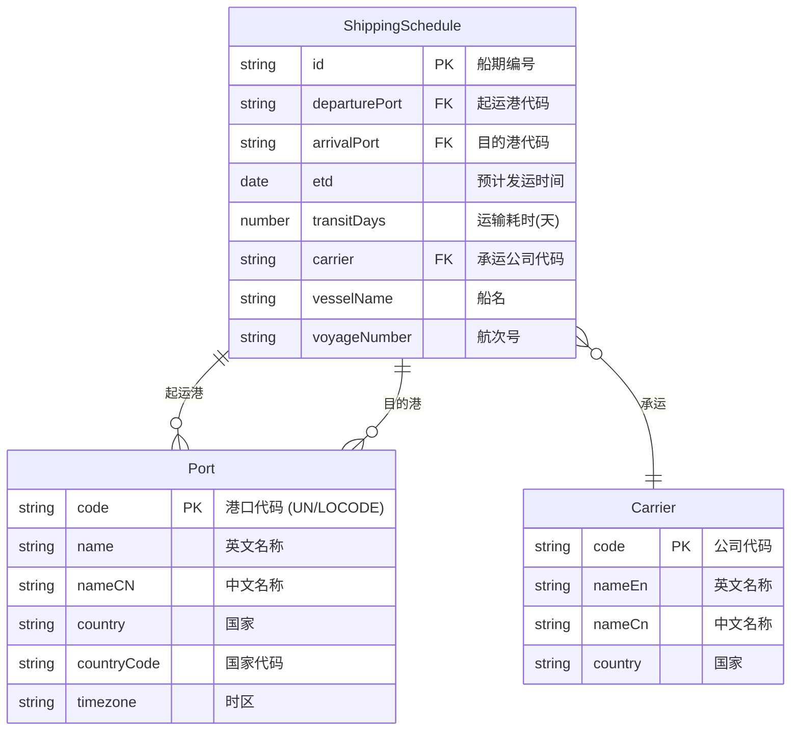
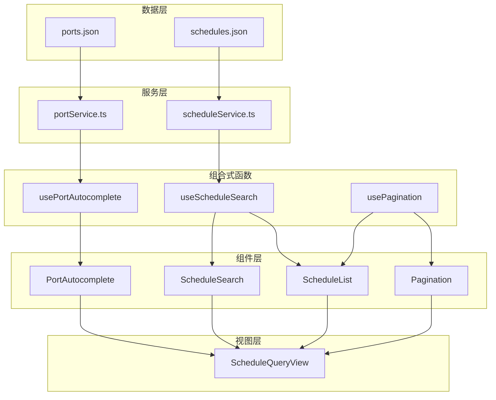

# Data Model: 航运船期查询

**Feature**: 002-shipping-schedule  
**Date**: 2026-01-09  
**Status**: Draft

## 实体关系图



## 实体定义

### 1. 港口 (Port)

复用现有数据结构，位于 `src/types/port.ts`。

| 字段 | 类型 | 必填 | 说明 |
|------|------|------|------|
| code | string | ✅ | 港口代码 (UN/LOCODE, 5位字母) |
| name | string | ✅ | 英文名称 |
| nameCN | string | ✅ | 中文名称 |
| country | string | ✅ | 所属国家 (英文) |
| countryCode | string | ✅ | ISO 3166-1 两字母国家代码 |
| timezone | string | ✅ | 时区 (IANA 格式) |

### 2. 船期 (ShippingSchedule)

新增实体，定义于 `src/types/schedule.ts`。

| 字段 | 类型 | 必填 | 说明 |
|------|------|------|------|
| id | string | ✅ | 唯一标识符 (格式: SCH-YYYYMMDD-XXX) |
| departurePort | string | ✅ | 起运港代码 (关联 Port.code) |
| arrivalPort | string | ✅ | 目的港代码 (关联 Port.code) |
| etd | string | ✅ | 预计发运时间 (ISO 8601 日期格式) |
| transitDays | number | ✅ | 运输耗时 (天数) |
| carrier | string | ✅ | 承运公司代码 |
| vesselName | string | ❌ | 船名 (可选) |
| voyageNumber | string | ❌ | 航次号 (可选) |

**业务规则**:
- `id` 格式: `SCH-YYYYMMDD-XXX`，其中 YYYYMMDD 为 ETD 日期，XXX 为序号
- `transitDays` 必须 > 0
- `etd` 必须为有效的 ISO 8601 日期
- `departurePort` 和 `arrivalPort` 不能相同

### 3. 承运公司 (Carrier)

嵌入式数据，不单独存储。在船期数据中直接使用公司代码。

| 代码 | 中文名称 | 英文名称 |
|------|----------|----------|
| MSC | 地中海航运 | Mediterranean Shipping Company |
| MAERSK | 马士基 | Maersk |
| CMACGM | 达飞轮船 | CMA CGM |
| COSCO | 中远海运 | COSCO Shipping |
| HPL | 赫伯罗特 | Hapag-Lloyd |
| EMC | 长荣海运 | Evergreen |
| ONE | 海洋网联 | Ocean Network Express |
| YML | 阳明海运 | Yang Ming |
| HMM | 现代商船 | Hyundai Merchant Marine |
| ZIM | 以星航运 | ZIM |

## 查询条件类型

### ScheduleSearchCriteria

| 字段 | 类型 | 必填 | 说明 |
|------|------|------|------|
| departurePort | string | ❌ | 起运港代码 |
| arrivalPort | string | ❌ | 目的港代码 |
| etdStart | string | ❌ | ETD 起始日期 (含) |
| etdEnd | string | ❌ | ETD 结束日期 (含) |

**业务规则**:
- 所有条件均为可选
- 多个条件为 AND 关系
- `etdStart` 不能晚于 `etdEnd`

## 数据文件结构

### ports.json (扩展现有)

新增以下港口以支持船期数据：

```json
[
  { "code": "CNXMN", "name": "Xiamen", "nameCN": "厦门", "country": "China", "countryCode": "CN", "timezone": "Asia/Shanghai" },
  { "code": "VNSGN", "name": "Ho Chi Minh City", "nameCN": "胡志明市", "country": "Vietnam", "countryCode": "VN", "timezone": "Asia/Ho_Chi_Minh" },
  { "code": "MYPKG", "name": "Port Klang", "nameCN": "巴生港", "country": "Malaysia", "countryCode": "MY", "timezone": "Asia/Kuala_Lumpur" },
  { "code": "LKCMB", "name": "Colombo", "nameCN": "科伦坡", "country": "Sri Lanka", "countryCode": "LK", "timezone": "Asia/Colombo" }
]
```

### schedules.json (新增)

船期数据文件，包含至少 30 条记录，覆盖：
- 时间范围：2025-12-09 至 2026-04-09（过去1个月到未来3个月）
- 航线区域：亚洲、欧洲、北美、中东、大洋洲
- 承运公司：覆盖 10 家主流航运公司

## 数据流图


