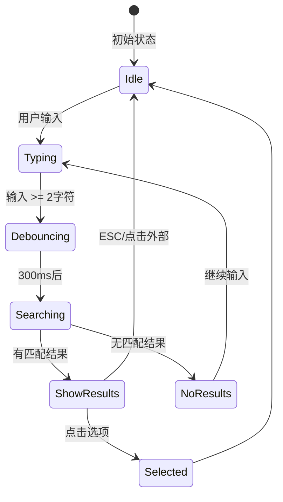
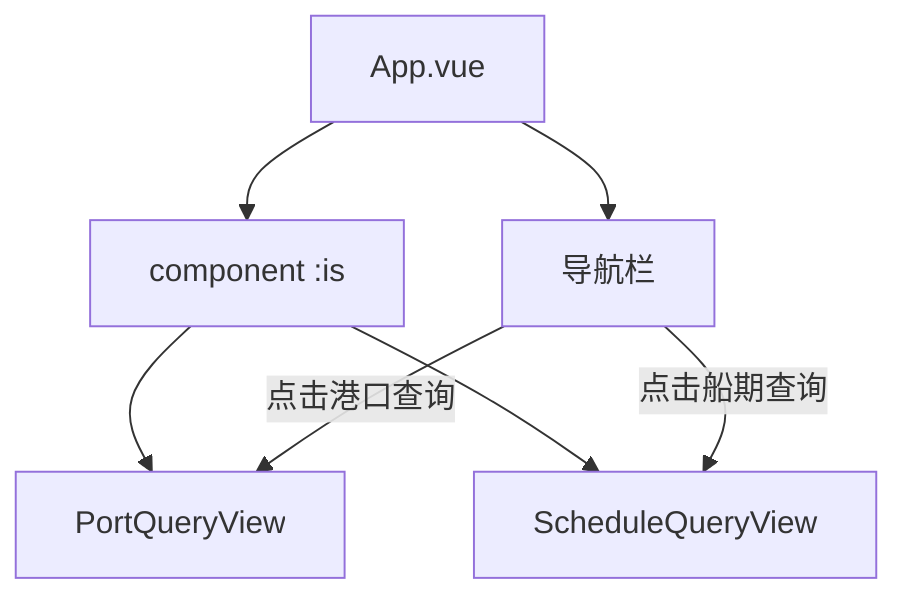

# Research: 航运船期查询

**Feature**: 002-shipping-schedule  
**Date**: 2026-01-09  
**Status**: Complete

## 目录

1. [Vue 3 自动补全实现](#1-vue-3-自动补全实现)
2. [防抖机制](#2-防抖机制)
3. [日期范围选择](#3-日期范围选择)
4. [简单路由实现](#4-简单路由实现)
5. [航运行业数据](#5-航运行业数据)
6. [决策总结](#6-决策总结)

---

## 1. Vue 3 自动补全实现

### 决策：使用 Composition API 自定义实现

**Rationale**: 项目规模较小，不需要引入额外依赖。自定义实现可以完全控制行为和样式。

**关键实现要点**:



**核心功能**:
- 防抖触发：输入 >= 2 字符后，300ms 防抖后触发搜索
- 键盘导航：上/下键切换、Enter 确认、ESC 关闭
- 点击外部关闭：使用 `v-click-outside` 自定义指令
- 无障碍支持：ARIA 属性（`role="combobox"`, `aria-expanded`, `aria-activedescendant`）

**Alternatives Considered**:
- VueUse 的 `useFocusWithin`：功能有限，不包含完整自动补全
- 第三方组件库：引入额外依赖，与简约设计原则冲突

---

## 2. 防抖机制

### 决策：使用原生 setTimeout 实现

**Rationale**: 项目未使用 VueUse，为避免新增依赖，使用原生实现。

**实现方案**:

```typescript
// composables/useDebounce.ts
export function useDebouncedRef<T>(value: Ref<T>, delay: number = 300): Ref<T> {
  const debouncedValue = ref(value.value) as Ref<T>
  let timer: ReturnType<typeof setTimeout> | null = null
  
  watch(value, (newValue) => {
    if (timer) clearTimeout(timer)
    timer = setTimeout(() => {
      debouncedValue.value = newValue
    }, delay)
  })
  
  onUnmounted(() => {
    if (timer) clearTimeout(timer)
  })
  
  return debouncedValue
}
```

**关键点**:
- 组件卸载时清理定时器（`onUnmounted`）
- 支持取消和立即执行

**Alternatives Considered**:
- VueUse `refDebounced`：需要新增依赖
- lodash `debounce`：需要新增依赖

---

## 3. 日期范围选择

### 决策：使用原生 input[type="date"]

**Rationale**: 无需引入日期选择器库，原生输入满足需求。

**实现要点**:
- 使用 `:min` 和 `:max` 属性限制日期范围
- 开始日期变更时验证结束日期
- 提供日期格式化工具函数

```typescript
// utils/dateUtils.ts
export const dateUtils = {
  formatToISO(date: Date): string {
    return date.toISOString().split('T')[0]
  },
  
  formatToChinese(dateStr: string): string {
    if (!dateStr) return ''
    const date = new Date(dateStr)
    return date.toLocaleDateString('zh-CN', {
      year: 'numeric',
      month: 'long',
      day: 'numeric'
    })
  },
  
  isValidRange(startStr: string, endStr: string): boolean {
    if (!startStr || !endStr) return true
    return new Date(startStr) <= new Date(endStr)
  }
}
```

---

## 4. 简单路由实现

### 决策：使用 component :is 动态组件

**Rationale**: 项目只有 2 个页面，不需要 vue-router 的完整功能。



**实现方案**:

```typescript
// App.vue
const routes = {
  'port-query': PortQueryView,
  'shipping-schedule': ScheduleQueryView
}

const currentRoute = ref<string>('port-query')
const currentComponent = shallowRef(routes['port-query'])

const navigate = (route: string) => {
  currentRoute.value = route
  currentComponent.value = routes[route]
}
```

**适用性分析**:
- ✅ 只有 2 个页面
- ✅ 不需要 URL 路由
- ✅ 不需要路由守卫
- ✅ 符合简约设计原则

---

## 5. 航运行业数据

### 5.1 全球主流航运公司

| 代码 | 英文名称 | 中文名称 | 国家 |
|------|----------|----------|------|
| MSC | Mediterranean Shipping Company | 地中海航运 | 瑞士 |
| MAERSK | Maersk | 马士基 | 丹麦 |
| CMACGM | CMA CGM | 达飞轮船 | 法国 |
| COSCO | COSCO Shipping | 中远海运 | 中国 |
| HPL | Hapag-Lloyd | 赫伯罗特 | 德国 |
| EMC | Evergreen | 长荣海运 | 台湾 |
| ONE | Ocean Network Express | 海洋网联 | 日本 |
| YML | Yang Ming | 阳明海运 | 台湾 |
| HMM | Hyundai Merchant Marine | 现代商船 | 韩国 |
| ZIM | ZIM | 以星航运 | 以色列 |

### 5.2 主要航线分类

| 航线类型 | 代码 | 示例航线 | 航行时间 |
|----------|------|----------|----------|
| 亚欧线 | AE | 上海→鹿特丹 | 28-35天 |
| 跨太平洋 | TP | 上海→洛杉矶 | 12-15天 |
| 跨大西洋 | TA | 鹿特丹→纽约 | 8-12天 |
| 亚洲区域 | IA | 上海→新加坡 | 4-7天 |

### 5.3 需要新增的港口数据

船期数据将使用以下港口（需与现有 ports.json 合并）：

**现有港口（24个）**: CNSHA, CNNGB, CNTAO, CNSZX, HKHKG, SGSIN, KRPUS, JPTYO, JPYOK, TWKHH, NLRTM, DEHAM, BEANR, GBFXT, ESVLC, USLAX, USLGB, USNYC, USSAV, BRSSZ, AEJEA, EGPSD, ZADUR, AUBNE, AUSYD

**需新增港口**:
- CNXMN (厦门) - 中国主要港口
- VNSGN (胡志明市) - 东南亚重要港口
- MYPKG (巴生港) - 马来西亚主要港口
- LKCMB (科伦坡) - 南亚中转港

---

## 6. 决策总结

| 技术决策 | 选择 | 理由 |
|----------|------|------|
| 自动补全 | 自定义 Composition API | 无需新依赖，完全可控 |
| 防抖实现 | 原生 setTimeout | 简约原则，无需依赖 |
| 日期选择 | 原生 input[type="date"] | 简约原则，满足需求 |
| 页面路由 | component :is | 只有2页，无需 vue-router |
| 点击外部 | v-click-outside 指令 | Vue 标准模式 |
| 数据存储 | 静态 JSON 文件 | 与现有模式一致 |

### 不引入的依赖

- ❌ vue-router（使用 component :is 替代）
- ❌ VueUse（使用原生实现）
- ❌ lodash（使用原生实现）
- ❌ 第三方日期选择器（使用原生 input）
- ❌ 第三方 UI 组件库（自定义组件）
