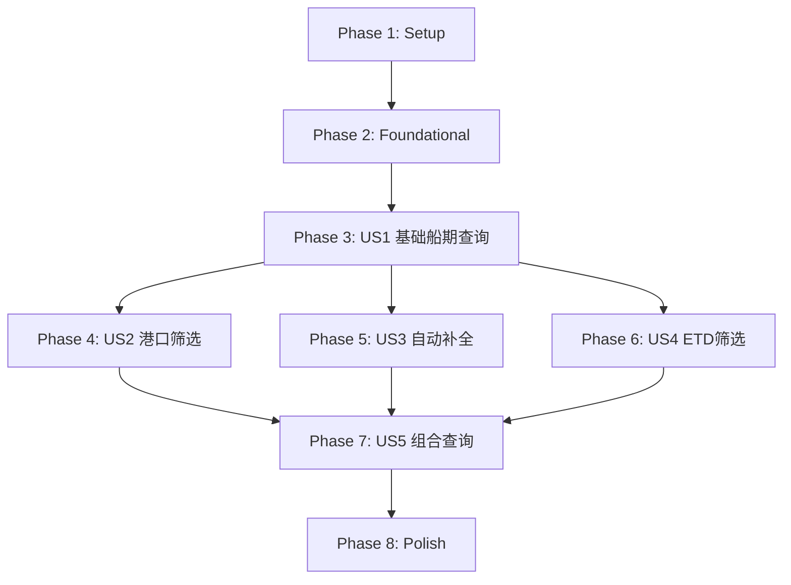

# Tasks: 航运船期查询

**Input**: Design documents from `/specs/002-shipping-schedule/`  
**Prerequisites**: plan.md ✅, spec.md ✅, research.md ✅, data-model.md ✅, contracts/ ✅  
**Created**: 2026-01-09

**Tests**: 本项目采用 TDD 流程,测试任务已包含在各 User Story 阶段中。

**Organization**: 任务按用户故事分组,支持独立实现和测试。

## Format: `[ID] [P?] [Story?] Description`

- **[P]**: 可并行执行(不同文件,无依赖)
- **[Story]**: 所属用户故事 (US1, US2, US3, US4, US5)
- 描述中包含确切的文件路径

## Path Conventions

- **Source**: `src/` at repository root
- **Tests**: `tests/` at repository root
- **Data**: `src/assets/data/`

---

## Phase 1: Setup (项目初始化)

**Purpose**: 创建基础类型和数据文件

- [X] T001 创建船期类型定义 `src/types/schedule.ts`
- [X] T002 [P] 创建船期静态数据文件 `src/assets/data/schedules.json` (至少30条记录)
- [X] T003 [P] 扩展港口数据文件 `src/assets/data/ports.json` (新增船期所需港口)
- [X] T004 [P] 更新术语表 `.specify/memory/glossary.md` (新增船期、ETD、承运公司等术语)

---

## Phase 2: Foundational (基础设施)

**Purpose**: 核心服务层实现,所有 User Story 的前置依赖

**⚠️ CRITICAL**: 此阶段必须完成后才能开始任何 User Story

- [X] T005 创建船期服务 `src/services/scheduleService.ts` (实现 loadSchedules, searchSchedules 方法)
- [X] T006 [P] 创建船期服务测试 `tests/unit/scheduleService.spec.ts`
- [X] T007 [P] 扩展港口服务 `src/services/portService.ts` (新增 fuzzySearchPorts 模糊搜索方法)
- [X] T008 [P] 扩展港口服务测试 `tests/unit/portService.spec.ts` (模糊搜索测试用例)
- [X] T009 创建防抖工具函数 `src/composables/useDebounce.ts`
- [X] T010 [P] 创建防抖工具测试 `tests/unit/useDebounce.spec.ts`

**Checkpoint**: 服务层就绪,可以开始 UI 层开发

---

## Phase 3: User Story 1 - 基础船期查询 (Priority: P1) 🎯 MVP

**Goal**: 用户进入船期查询页面可看到船期列表,支持分页浏览

**Independent Test**: 进入页面 → 验证数据加载和展示功能

### Tests for User Story 1

- [X] T011 [P] [US1] 创建船期列表组件测试 `tests/components/ScheduleList.spec.ts`
- [X] T012 [P] [US1] 创建船期查询视图测试 `tests/components/ScheduleQueryView.spec.ts`

### Implementation for User Story 1

- [X] T013 [US1] 创建船期列表组件 `src/components/ScheduleList.vue` (显示起运港、目的港、ETD、运输耗时、承运公司)
- [X] T014 [US1] 创建船期查询视图 `src/views/ScheduleQueryView.vue` (加载数据、调用 ScheduleList)
- [X] T015 [US1] 创建船期搜索 composable `src/composables/useScheduleSearch.ts` (数据加载、分页逻辑)
- [X] T016 [P] [US1] 创建 composable 测试 `tests/unit/useScheduleSearch.spec.ts`
- [X] T017 [US1] 修改 App.vue 添加导航栏和页面切换 (使用 component :is 动态组件)
- [X] T018 [US1] 集成分页组件 (复用 `src/components/Pagination.vue`)

**Checkpoint**: User Story 1 完成 - 用户可以查看船期列表并分页浏览 ✅

---

## Phase 4: User Story 2 - 按起运港/目的港查询 (Priority: P1)

**Goal**: 用户可根据起运港和/或目的港筛选船期

**Independent Test**: 选择港口 → 返回匹配的船期列表

### Tests for User Story 2

- [X] T019 [P] [US2] 扩展船期服务测试 `tests/unit/scheduleService.spec.ts` (港口筛选测试用例) - Phase 2 已完成

### Implementation for User Story 2

- [X] T020 [US2] 扩展 scheduleService.ts 添加 filterByPorts 方法 `src/services/scheduleService.ts` - Phase 2 已完成
- [X] T021 [US2] 创建船期搜索条件组件 `src/components/ScheduleSearch.vue` (起运港/目的港输入框、查询按钮、重置按钮)
- [X] T022 [P] [US2] 创建搜索条件组件测试 `tests/components/ScheduleSearch.spec.ts`
- [X] T023 [US2] 更新 ScheduleQueryView.vue 集成搜索条件组件
- [X] T024 [US2] 更新 useScheduleSearch.ts 支持港口筛选条件 - Phase 2 已完成

**Checkpoint**: User Story 2 完成 - 用户可按港口筛选船期 ✅

---

## Phase 5: User Story 3 - 港口自动补全 (Priority: P1)

**Goal**: 用户输入港口时获得自动补全建议,300ms 防抖

**Independent Test**: 输入字符 → 显示匹配的港口选项

### Tests for User Story 3

- [X] T025 [P] [US3] 创建港口自动补全组件测试 `tests/components/PortAutocomplete.spec.ts`
- [X] T026 [P] [US3] 创建自动补全 composable 测试 `tests/unit/usePortAutocomplete.spec.ts`

### Implementation for User Story 3

- [X] T027 [US3] 创建港口自动补全 composable `src/composables/usePortAutocomplete.ts` (集成 300ms 防抖)
- [X] T028 [US3] 创建港口自动补全组件 `src/components/PortAutocomplete.vue` (下拉列表、键盘导航、点击选择)
- [X] T029 [US3] 更新 ScheduleSearch.vue 将输入框替换为 PortAutocomplete 组件

**Checkpoint**: User Story 3 完成 - 港口输入支持自动补全 ✅

---

## Phase 6: User Story 4 - 按ETD时间范围查询 (Priority: P2)

**Goal**: 用户可按 ETD 时间范围筛选船期

**Independent Test**: 设置时间范围 → 返回该范围内的船期

### Tests for User Story 4

- [X] T030 [P] [US4] 扩展船期服务测试 `tests/unit/scheduleService.spec.ts` (ETD 筛选测试用例) - Phase 2 已完成

### Implementation for User Story 4

- [X] T031 [US4] 扩展 scheduleService.ts 添加 filterByEtdRange 方法 `src/services/scheduleService.ts` - Phase 2 已完成
- [X] T032 [US4] 更新 ScheduleSearch.vue 添加 ETD 起始/结束日期输入 (使用 input[type="date"])
- [X] T033 [US4] 更新 useScheduleSearch.ts 支持 ETD 时间范围筛选
- [X] T034 [US4] 添加日期验证 (起始日期不能晚于结束日期)

**Checkpoint**: User Story 4 完成 - 用户可按 ETD 时间范围筛选船期 ✅

---

## Phase 7: User Story 5 - 组合条件查询 (Priority: P2)

**Goal**: 用户可同时使用多个条件进行筛选,并一键重置

**Independent Test**: 设置多个条件 → 返回同时满足所有条件的船期

### Tests for User Story 5

- [X] T035 [P] [US5] 扩展船期服务测试 `tests/unit/scheduleService.spec.ts` (组合条件测试用例) - Phase 2 已完成
- [X] T036 [P] [US5] 更新搜索条件组件测试 `tests/components/ScheduleSearch.spec.ts` (重置功能测试) - Phase 4 已完成

### Implementation for User Story 5

- [X] T037 [US5] 扩展 scheduleService.ts 实现 searchSchedules 组合筛选 `src/services/scheduleService.ts` - Phase 2 已完成
- [X] T038 [US5] 更新 ScheduleSearch.vue 实现重置按钮功能 - Phase 4 已完成
- [X] T039 [US5] 更新 useScheduleSearch.ts 整合所有筛选条件 - Phase 6 已完成
- [X] T040 [US5] 端到端验证:组合条件查询和重置功能

**Checkpoint**: User Story 5 完成 - 用户可进行组合条件查询并重置 ✅

---

## Phase 8: Polish & Cross-Cutting Concerns

**Purpose**: 完善和优化

- [X] T041 [P] 添加错误处理:数据加载失败提示 `src/views/ScheduleQueryView.vue`
- [X] T042 [P] 添加空数据状态提示 `src/components/ScheduleList.vue`
- [X] T043 [P] 代码清理和重构
- [X] T044 运行 quickstart.md 验证所有功能
- [X] T045 [P] 更新 README 或项目文档

**Checkpoint**: Phase 8 完成 - 项目已完成全部功能实现和测试 ✅

---

## Dependencies & Execution Order

### Phase Dependencies



### User Story Dependencies

| User Story | 依赖 | 可并行 |
|------------|------|--------|
| US1 基础船期查询 | Phase 2 完成 | - |
| US2 港口筛选 | US1 完成 | 与 US3, US4 可并行 |
| US3 自动补全 | US1 完成 | 与 US2, US4 可并行 |
| US4 ETD筛选 | US1 完成 | 与 US2, US3 可并行 |
| US5 组合查询 | US2, US3, US4 完成 | - |

### Within Each User Story

1. 测试先行 (Tests MUST fail before implementation)
2. 服务层优先于组件层
3. 组件优先于视图集成
4. 核心功能优先于优化

---

## Parallel Opportunities

### Phase 1 并行任务

```bash
# 可同时执行:
T002: 创建 schedules.json
T003: 扩展 ports.json
T004: 更新术语表
```

### Phase 2 并行任务

```bash
# 可同时执行:
T006: scheduleService 测试
T007: portService 扩展
T008: portService 测试
T010: useDebounce 测试
```

### User Story 并行 (US1 完成后)

```bash
# US2、US3、US4 可由不同开发者并行:
Developer A: Phase 4 (US2 港口筛选)
Developer B: Phase 5 (US3 自动补全)
Developer C: Phase 6 (US4 ETD筛选)
```

---

## Implementation Strategy

### MVP First (仅 User Story 1)

1. 完成 Phase 1: Setup
2. 完成 Phase 2: Foundational
3. 完成 Phase 3: User Story 1
4. **STOP and VALIDATE**: 验证基础船期查询功能
5. 可部署 MVP 版本

### Incremental Delivery

1. Setup + Foundational → 基础就绪
2. + User Story 1 → **MVP**: 船期列表展示 ✅
3. + User Story 2 → 港口筛选功能 ✅
4. + User Story 3 → 自动补全体验 ✅
5. + User Story 4 → ETD 时间筛选 ✅
6. + User Story 5 → 组合查询完整版 ✅
7. Polish → 生产就绪

---

## Summary

| 统计项 | 数值 |
|--------|------|
| **总任务数** | 45 |
| **Phase 1 (Setup)** | 4 |
| **Phase 2 (Foundational)** | 6 |
| **US1 基础船期查询** | 8 |
| **US2 港口筛选** | 6 |
| **US3 自动补全** | 5 |
| **US4 ETD筛选** | 5 |
| **US5 组合查询** | 6 |
| **Phase 8 (Polish)** | 5 |
| **并行任务数** | 23 (51%) |
| **MVP 范围** | T001-T018 (18 tasks) |

---

## Notes

- [P] 任务 = 不同文件,无依赖,可并行
- [Story] 标签 = 任务所属用户故事,便于追溯
- 每个 User Story 应可独立完成和测试
- 测试先行:确保测试失败后再实现功能
- 每个任务或逻辑组完成后提交代码
- 在任何 Checkpoint 暂停以验证故事独立性
