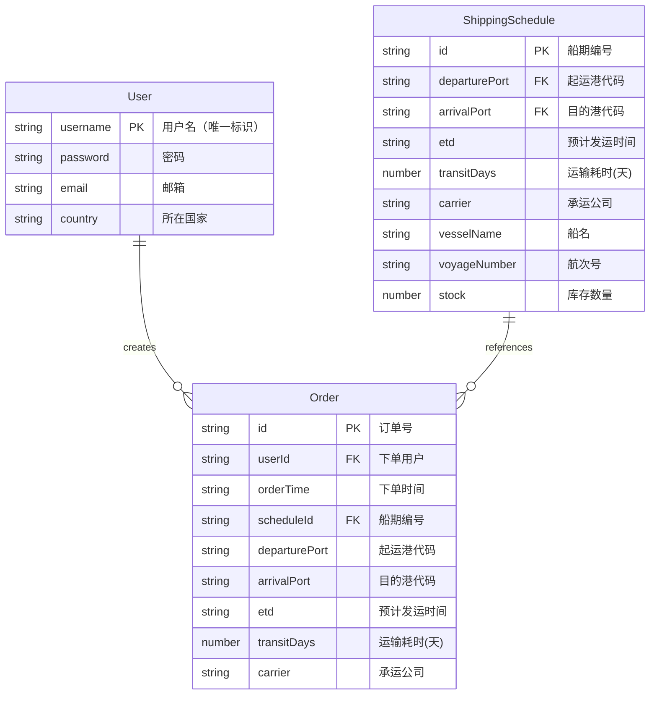
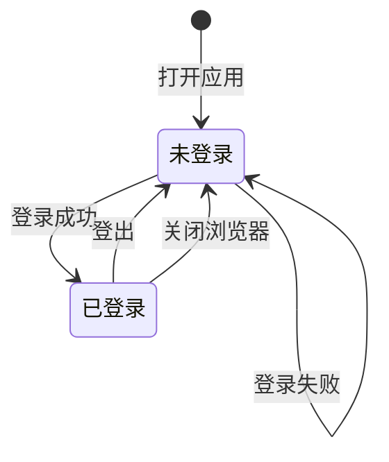
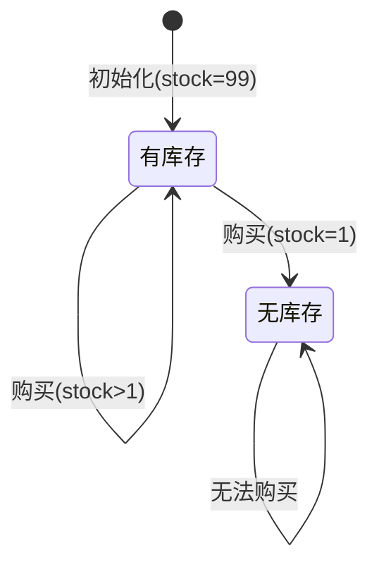
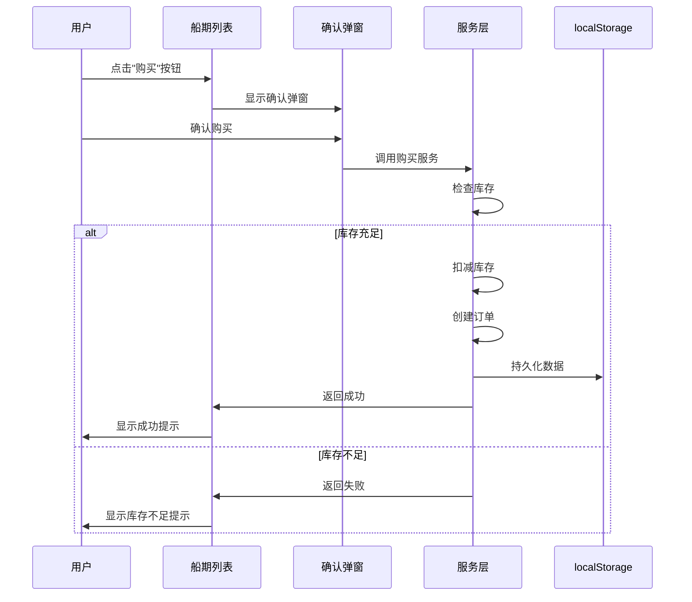

# 数据模型: 用户登录、舱位购买与订单查询

**功能分支**: `003-user-booking-order`  
**创建日期**: 2026年1月9日  
**状态**: Phase 1 完成

## 实体关系图



## 实体详细定义

### 1. User（用户）

表示系统用户，用于登录认证。

| 字段 | 类型 | 必填 | 说明 |
|------|------|------|------|
| username | string | ✓ | 用户名，唯一标识，用于登录 |
| password | string | ✓ | 密码，明文存储（仅演示用途） |
| email | string | ✓ | 邮箱地址 |
| country | string | ✓ | 所在国家 |

**约束**:
- username 必须唯一
- 所有字段不可为空

**默认数据**: 5个用户，分别来自中国、美国、德国、新加坡、日本

```json
[
  { "username": "zhangsan", "password": "123456", "email": "zhangsan@example.com", "country": "中国" },
  { "username": "john", "password": "123456", "email": "john@example.com", "country": "美国" },
  { "username": "hans", "password": "123456", "email": "hans@example.com", "country": "德国" },
  { "username": "lim", "password": "123456", "email": "lim@example.com", "country": "新加坡" },
  { "username": "tanaka", "password": "123456", "email": "tanaka@example.com", "country": "日本" }
]
```

---

### 2. ShippingSchedule（船期）

在现有船期实体基础上新增库存字段。

| 字段 | 类型 | 必填 | 说明 |
|------|------|------|------|
| id | string | ✓ | 船期编号 (格式: SCH-YYYYMMDD-XXX) |
| departurePort | string | ✓ | 起运港代码 (关联 Port.code) |
| arrivalPort | string | ✓ | 目的港代码 (关联 Port.code) |
| etd | string | ✓ | 预计发运时间 (ISO 8601 日期格式) |
| transitDays | number | ✓ | 运输耗时 (天数) |
| carrier | string | ✓ | 承运公司代码 |
| vesselName | string | - | 船名 (可选) |
| voyageNumber | string | - | 航次号 (可选) |
| **stock** | number | ✓ | **新增: 库存数量，默认 99** |

**变更说明**:
- 新增 `stock` 字段，初始值为 99
- 库存为 0 时不可购买

---

### 3. Order（订单）

表示用户购买舱位的订单记录。

| 字段 | 类型 | 必填 | 说明 |
|------|------|------|------|
| id | string | ✓ | 订单号 (格式: ORD-YYYYMMDD-XXX) |
| userId | string | ✓ | 下单用户的用户名 |
| orderTime | string | ✓ | 下单时间 (ISO 8601 日期时间格式) |
| scheduleId | string | ✓ | 关联的船期编号 |
| departurePort | string | ✓ | 起运港代码 (冗余存储) |
| arrivalPort | string | ✓ | 目的港代码 (冗余存储) |
| etd | string | ✓ | 预计发运时间 (冗余存储) |
| transitDays | number | ✓ | 运输耗时 (冗余存储) |
| carrier | string | ✓ | 承运公司 (冗余存储) |

**设计决策**:
- 订单中冗余存储船期信息，确保历史订单数据完整性
- 即使船期数据变更，已下单的订单信息保持不变

**订单号生成规则**:
- 格式: `ORD-YYYYMMDD-XXX`
- 示例: `ORD-20260109-001`, `ORD-20260109-002`
- XXX: 当日序号，从 001 开始递增

---

## 状态转换

### 用户登录状态



### 船期库存状态



### 购买流程



---

## 数据存储

### 存储位置

| 数据 | 存储方式 | 说明 |
|------|----------|------|
| 用户数据 | 静态 JSON 文件 | `src/assets/data/users.json` |
| 船期数据(初始) | 静态 JSON 文件 | `src/assets/data/schedules.json` |
| 船期数据(运行时) | localStorage | key: `schedules` |
| 订单数据 | localStorage | key: `orders` |
| 登录状态 | sessionStorage | key: `currentUser` |

### localStorage 数据结构

```typescript
// key: "schedules"
// value: ShippingSchedule[] (包含 stock 字段)

// key: "orders"  
// value: Order[]

// key (sessionStorage): "currentUser"
// value: User (当前登录用户)
```

---

## 验证规则

### 用户登录

| 规则 | 说明 |
|------|------|
| 用户名必填 | 不能为空字符串 |
| 密码必填 | 不能为空字符串 |
| 用户名存在 | 必须在用户列表中存在 |
| 密码匹配 | 密码必须与用户数据匹配 |

### 舱位购买

| 规则 | 说明 |
|------|------|
| 用户已登录 | 必须处于登录状态 |
| 库存充足 | stock > 0 |
| 用户确认 | 必须在确认弹窗中确认 |

### 订单查询

| 规则 | 说明 |
|------|------|
| 用户已登录 | 必须处于登录状态 |
| 归属验证 | 只能查询自己的订单 |
