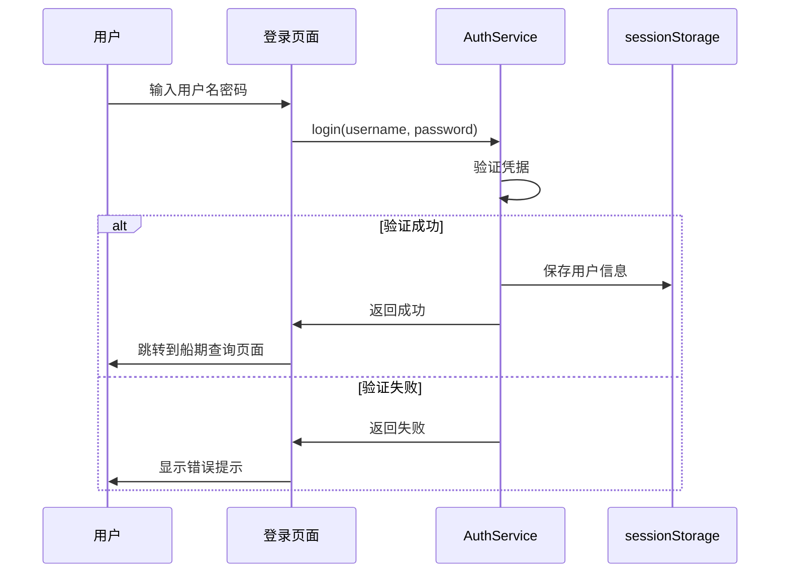
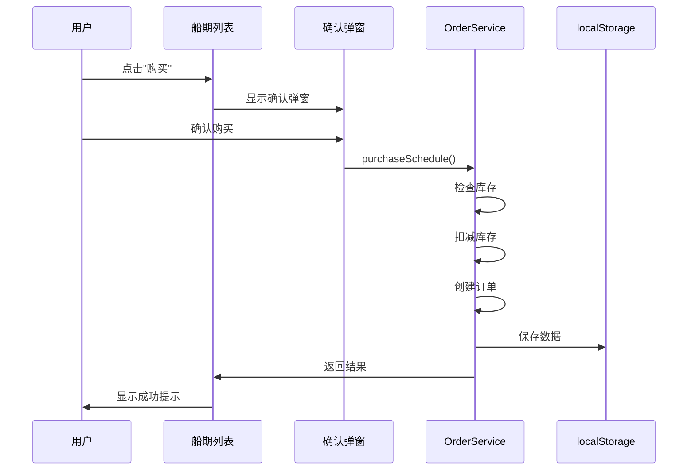

# 快速开始: 用户登录、舱位购买与订单查询

**功能分支**: `003-user-booking-order`  
**创建日期**: 2026年1月9日

## 概述

本功能在现有航运信息平台基础上扩展：
1. **用户登录/登出** - 保护系统功能，仅登录用户可访问
2. **舱位购买** - 在船期查询结果中显示库存和购买按钮
3. **订单查询** - 查看购买历史和订单详情

## 快速验证

### 1. 启动开发服务器

```bash
npm run dev
```

### 2. 登录系统

使用以下任一默认账户登录：

| 用户名 | 密码 | 国家 |
|--------|------|------|
| zhangsan | 123456 | 中国 |
| john | 123456 | 美国 |
| hans | 123456 | 德国 |
| lim | 123456 | 新加坡 |
| tanaka | 123456 | 日本 |

### 3. 验证功能

1. **船期查询页面**
   - 登录后自动跳转到船期查询页面
   - 船期列表显示"库存: XX"
   - 有库存时显示"购买"按钮

2. **购买舱位**
   - 点击"购买"按钮
   - 确认弹窗中点击"确认"
   - 看到成功提示和订单号

3. **查询订单**
   - 点击导航栏"我的订单"
   - 查看订单列表
   - 输入订单号精确查询

4. **登出**
   - 点击顶部"登出"按钮
   - 返回登录页面

## 运行测试

```bash
# 运行所有测试
npm test

# 监视模式
npm run test:watch

# 覆盖率报告
npm run test:coverage
```

## 文件结构

```
src/
├── assets/data/
│   ├── users.json          # 用户数据
│   ├── orders.json         # 订单数据（初始为空）
│   └── schedules.json      # 船期数据（含 stock 字段）
├── components/
│   ├── LoginForm.vue       # 登录表单
│   ├── UserHeader.vue      # 用户信息头部
│   ├── PurchaseDialog.vue  # 购买确认弹窗
│   ├── OrderList.vue       # 订单列表
│   └── OrderSearch.vue     # 订单搜索
├── composables/
│   ├── useAuth.ts          # 认证状态
│   └── useOrderSearch.ts   # 订单查询
├── services/
│   ├── userService.ts      # 用户服务
│   └── orderService.ts     # 订单服务
├── types/
│   ├── user.ts             # 用户类型
│   └── order.ts            # 订单类型
└── views/
    ├── LoginView.vue       # 登录页面
    └── OrderQueryView.vue  # 订单查询页面
```

## 数据持久化

| 数据 | 存储位置 | 说明 |
|------|----------|------|
| 用户 | 静态 JSON | 只读，不可修改 |
| 船期 | localStorage | 运行时库存变更 |
| 订单 | localStorage | 新增订单保存 |
| 登录状态 | sessionStorage | 浏览器会话有效 |

## 关键流程

### 登录流程



### 购买流程



## 注意事项

1. **浏览器关闭后登录状态失效** - 使用 sessionStorage
2. **订单数据跨会话保留** - 使用 localStorage
3. **库存变更实时持久化** - 购买成功后立即保存
4. **只能查询自己的订单** - 订单查询有用户验证

## 故障排除

### 登录失败

1. 确认用户名和密码正确
2. 检查 `src/assets/data/users.json` 是否存在

### 数据不持久

1. 检查浏览器 localStorage 是否可用
2. 确认没有开启隐私模式

### 库存显示异常

1. 清除 localStorage: `localStorage.clear()`
2. 刷新页面重新初始化数据
