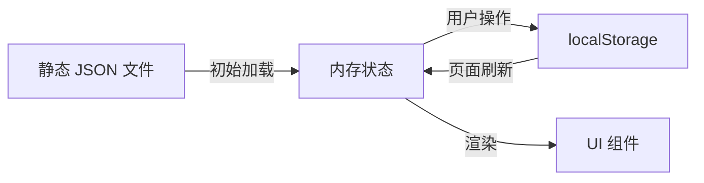

# 研究文档: 用户登录、舱位购买与订单查询

**功能分支**: `003-user-booking-order`  
**创建日期**: 2026年1月9日  
**状态**: Phase 0 完成

## 研究任务

### 1. Vue 3 纯前端用户认证方案

**研究问题**: 如何在无后端 API 的纯前端 Vue 3 应用中实现用户登录/登出功能？

**结论**:

**决策**: 使用 sessionStorage 管理登录状态，配合 Vue 3 响应式系统实现全局状态管理

**理由**:
- sessionStorage 在浏览器会话期间保持数据，关闭浏览器自动清除，符合需求
- 无需引入额外状态管理库（如 Pinia），保持项目简洁
- 通过 `ref` + `provide/inject` 或 composable 模式实现跨组件状态共享

**替代方案**:
- localStorage: 数据持久化过久，不符合"浏览器关闭失效"需求
- Pinia: 功能强大但对当前简单需求过度设计
- Cookie: 需要处理过期时间，增加复杂度

**实现模式**:

```typescript
// composables/useAuth.ts
import { ref, readonly } from 'vue'

const STORAGE_KEY = 'currentUser'

const currentUser = ref<User | null>(null)

export function useAuth() {
  function login(username: string, password: string): boolean {
    // 验证逻辑
    if (valid) {
      currentUser.value = user
      sessionStorage.setItem(STORAGE_KEY, JSON.stringify(user))
      return true
    }
    return false
  }

  function logout() {
    currentUser.value = null
    sessionStorage.removeItem(STORAGE_KEY)
  }

  function restoreSession() {
    const stored = sessionStorage.getItem(STORAGE_KEY)
    if (stored) {
      currentUser.value = JSON.parse(stored)
    }
  }

  return {
    currentUser: readonly(currentUser),
    isLoggedIn: computed(() => !!currentUser.value),
    login,
    logout,
    restoreSession
  }
}
```

---

### 2. 纯前端数据持久化方案

**研究问题**: 如何在纯前端应用中持久化订单和库存数据？

**结论**:

**决策**: 使用 localStorage 持久化订单和库存变更，结合静态 JSON 文件作为初始数据源

**理由**:
- 订单数据需要跨会话保留，localStorage 是最简单的持久化方案
- 静态 JSON 文件提供初始数据，运行时变更存储在 localStorage
- 避免引入 IndexedDB 等复杂方案

**数据流设计**:



**实现策略**:

1. **初始化**: 首次访问时，从静态 JSON 加载数据到 localStorage
2. **运行时**: 所有读写操作都通过 localStorage
3. **合并逻辑**: 检测 localStorage 是否有数据，有则使用，无则从 JSON 初始化

```typescript
// services/orderService.ts
const ORDERS_KEY = 'orders'

function loadOrders(): Order[] {
  const stored = localStorage.getItem(ORDERS_KEY)
  if (stored) {
    return JSON.parse(stored)
  }
  // 首次访问，返回空数组
  return []
}

function saveOrders(orders: Order[]): void {
  localStorage.setItem(ORDERS_KEY, JSON.stringify(orders))
}
```

---

### 3. Vue 3 路由守卫无 vue-router 实现

**研究问题**: 现有项目使用动态组件切换页面，如何实现登录拦截？

**结论**:

**决策**: 在 App.vue 中添加认证检查逻辑，未登录时强制显示登录页面

**理由**:
- 保持现有架构一致性，无需引入 vue-router
- 简单直接，通过条件渲染实现
- 登录状态变化时自动更新显示

**实现模式**:

```vue
<script setup lang="ts">
import { useAuth } from './composables/useAuth'
import LoginView from './views/LoginView.vue'

const { isLoggedIn, restoreSession } = useAuth()

// 应用启动时恢复会话
onMounted(() => {
  restoreSession()
})
</script>

<template>
  <!-- 未登录显示登录页 -->
  <LoginView v-if="!isLoggedIn" />
  
  <!-- 已登录显示正常应用 -->
  <div v-else id="app">
    <!-- 导航栏 + 页面内容 -->
  </div>
</template>
```

---

### 4. 订单号生成策略

**研究问题**: 如何在前端生成唯一订单号？

**结论**:

**决策**: 使用日期 + 序号格式 (ORD-YYYYMMDD-XXX)，序号从当日已有订单数推算

**理由**:
- 格式清晰，便于人工识别
- 日期分组便于管理
- 序号递增确保当日唯一性

**实现**:

```typescript
function generateOrderId(existingOrders: Order[]): string {
  const today = new Date()
  const dateStr = today.toISOString().slice(0, 10).replace(/-/g, '')
  
  // 统计当日订单数
  const todayPrefix = `ORD-${dateStr}`
  const todayOrders = existingOrders.filter(o => o.id.startsWith(todayPrefix))
  const sequence = (todayOrders.length + 1).toString().padStart(3, '0')
  
  return `${todayPrefix}-${sequence}`
}
```

---

### 5. 购买确认弹窗组件设计

**研究问题**: Vue 3 中如何实现确认弹窗组件？

**结论**:

**决策**: 创建 PurchaseDialog 组件，通过 props 控制显示，emit 事件处理确认/取消

**理由**:
- 组件化设计，可复用
- 符合 Vue 3 组件通信模式
- 不引入额外 UI 库

**组件接口**:

```typescript
// PurchaseDialog.vue
defineProps<{
  visible: boolean
  schedule: ShippingSchedule
}>()

defineEmits<{
  (e: 'confirm'): void
  (e: 'cancel'): void
}>()
```

---

### 6. 库存管理与一致性

**研究问题**: 如何确保库存扣减与订单创建的一致性？

**结论**:

**决策**: 在单个操作中同步执行库存检查、扣减和订单创建，失败时回滚

**理由**:
- 纯前端单用户场景，无并发问题
- 同步操作确保数据一致
- 简单的事务模拟即可满足需求

**实现模式**:

```typescript
async function purchaseSchedule(scheduleId: string, userId: string): Promise<PurchaseResult> {
  // 1. 获取当前库存
  const schedule = getScheduleById(scheduleId)
  if (!schedule || schedule.stock <= 0) {
    return { success: false, error: '库存不足' }
  }

  // 2. 扣减库存 (内存)
  schedule.stock -= 1

  // 3. 创建订单
  const order = createOrder(schedule, userId)

  // 4. 持久化
  try {
    saveSchedules(schedules)
    saveOrders([...orders, order])
    return { success: true, orderId: order.id }
  } catch (e) {
    // 回滚库存
    schedule.stock += 1
    return { success: false, error: '保存失败，请重试' }
  }
}
```

---

## 技术决策总结

| 决策点 | 选择 | 理由 |
|--------|------|------|
| 登录状态存储 | sessionStorage | 浏览器会话有效，关闭失效 |
| 订单/库存持久化 | localStorage | 跨会话保留，简单可靠 |
| 状态管理 | Composable 模式 | 轻量级，符合现有架构 |
| 路由守卫 | 条件渲染 | 无需 vue-router，保持一致 |
| 订单号生成 | 日期+序号 | 格式清晰，确保唯一 |
| 确认弹窗 | 自定义组件 | 轻量，无需 UI 库 |

## 遗留问题

无。所有技术问题已澄清。
