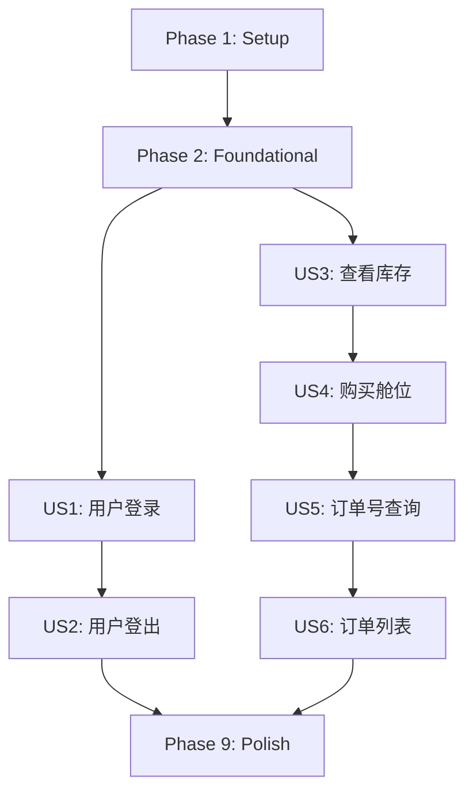

# Tasks: 用户登录、舱位购买与订单查询

**Input**: Design documents from `/specs/003-user-booking-order/`
**Prerequisites**: plan.md ✓, spec.md ✓, research.md ✓, data-model.md ✓, contracts/ ✓

**Organization**: Tasks are grouped by user story to enable independent implementation and testing of each story.

## Format: `[ID] [P?] [Story] Description`

- **[P]**: Can run in parallel (different files, no dependencies)
- **[Story]**: Which user story this task belongs to (e.g., US1, US2)
- Include exact file paths in descriptions

---

## Phase 1: Setup (项目初始化)

**Purpose**: 创建新文件结构和基础配置

- [X] T001 创建用户类型定义 in src/types/user.ts
- [X] T002 [P] 创建订单类型定义 in src/types/order.ts
- [X] T003 [P] 创建用户静态数据文件 in src/assets/data/users.json
- [X] T004 [P] 更新船期类型定义添加 stock 字段 in src/types/schedule.ts
- [X] T005 更新船期静态数据添加 stock 字段 in src/assets/data/schedules.json

---

## Phase 2: Foundational (基础设施)

**Purpose**: 核心基础设施，所有用户故事的前置依赖

**⚠️ CRITICAL**: 必须完成此阶段才能开始用户故事实现

- [X] T006 实现用户服务 userService in src/services/userService.ts
- [X] T007 [P] 实现用户服务单元测试 in tests/unit/userService.spec.ts
- [X] T008 实现认证 composable useAuth in src/composables/useAuth.ts
- [X] T009 [P] 实现 useAuth 单元测试 in tests/unit/useAuth.spec.ts

**Checkpoint**: 基础设施就绪，用户故事实现可以开始

---

## Phase 3: User Story 1 - 用户登录 (Priority: P1) 🎯 MVP

**Goal**: 用户能够使用用户名和密码登录系统，访问系统功能

**Independent Test**: 用户输入正确的用户名和密码，成功登录后跳转到船期查询页面

### Implementation for User Story 1

- [X] T010 [US1] 创建登录表单组件 LoginForm.vue in src/components/LoginForm.vue
- [X] T011 [P] [US1] 创建 LoginForm 组件测试 in tests/components/LoginForm.spec.ts
- [X] T012 [US1] 创建登录页面视图 LoginView.vue in src/views/LoginView.vue
- [X] T013 [US1] 修改 App.vue 添加登录状态检查和路由守卫 in src/App.vue

**Checkpoint**: User Story 1 完成 - 用户可以登录系统

---

## Phase 4: User Story 2 - 用户登出 (Priority: P1)

**Goal**: 已登录用户能够安全退出系统

**Independent Test**: 已登录用户点击登出按钮，成功退出并返回登录页面

### Implementation for User Story 2

- [X] T014 [US2] 创建用户头部组件 UserHeader.vue（含用户名和登出按钮） in src/components/UserHeader.vue
- [X] T015 [P] [US2] 创建 UserHeader 组件测试 in tests/components/UserHeader.spec.ts
- [X] T016 [US2] 在 App.vue 中集成 UserHeader 组件 in src/App.vue

**Checkpoint**: User Story 2 完成 - 用户可以登录和登出

---

## Phase 5: User Story 3 - 查看船期库存 (Priority: P1)

**Goal**: 已登录用户在船期查询结果中看到每个船期的可用库存数量

**Independent Test**: 用户查询船期后，每条船期结果中显示当前库存数量和购买/暂无库存状态

### Implementation for User Story 3

- [X] T017 [US3] 扩展 scheduleService 支持库存管理（加载、保存、扣减库存） in src/services/scheduleService.ts
- [X] T018 [P] [US3] 更新 scheduleService 单元测试 in tests/unit/scheduleService.spec.ts
- [X] T019 [US3] 修改 ScheduleList.vue 添加库存展示和购买按钮 in src/components/ScheduleList.vue
- [X] T020 [P] [US3] 更新 ScheduleList 组件测试 in tests/components/ScheduleList.spec.ts

**Checkpoint**: User Story 3 完成 - 用户可以查看库存状态

---

## Phase 6: User Story 4 - 购买舱位 (Priority: P1)

**Goal**: 已登录用户能够购买有库存的船期舱位，系统自动创建订单并扣减库存

**Independent Test**: 用户点击购买按钮，确认后系统创建订单、扣减库存，并显示购买成功提示

### Implementation for User Story 4

- [X] T021 [US4] 实现订单服务 orderService in src/services/orderService.ts
- [X] T022 [P] [US4] 创建 orderService 单元测试 in tests/unit/orderService.spec.ts
- [X] T023 [US4] 创建购买确认弹窗组件 PurchaseDialog.vue in src/components/PurchaseDialog.vue
- [X] T024 [P] [US4] 创建 PurchaseDialog 组件测试 in tests/components/PurchaseDialog.spec.ts
- [X] T025 [US4] 在 ScheduleList.vue 中集成购买流程（弹窗触发、确认购买、成功提示） in src/components/ScheduleList.vue

**Checkpoint**: User Story 4 完成 - 用户可以完成完整的购买流程（MVP核心功能）

---

## Phase 7: User Story 5 - 按订单号查询订单 (Priority: P2)

**Goal**: 已登录用户能够根据订单号查询我购买过的订单，查看订单详细信息

**Independent Test**: 用户输入订单号进行查询，系统返回匹配的订单详细信息

### Implementation for User Story 5

- [X] T026 [US5] 实现订单查询 composable useOrderSearch in src/composables/useOrderSearch.ts
- [X] T027 [P] [US5] 创建 useOrderSearch 单元测试 in tests/unit/useOrderSearch.spec.ts
- [X] T028 [US5] 创建订单搜索组件 OrderSearch.vue in src/components/OrderSearch.vue
- [X] T029 [P] [US5] 创建 OrderSearch 组件测试 in tests/components/OrderSearch.spec.ts

**Checkpoint**: User Story 5 完成 - 用户可以按订单号查询订单

---

## Phase 8: User Story 6 - 查看我的订单列表 (Priority: P2)

**Goal**: 已登录用户能够查看我所有的订单记录，无需记住每个订单号

**Independent Test**: 用户进入订单查询页面，默认显示当前用户的所有订单列表

### Implementation for User Story 6

- [X] T030 [US6] 创建订单列表组件 OrderList.vue（含分页） in src/components/OrderList.vue
- [X] T031 [P] [US6] 创建 OrderList 组件测试 in tests/components/OrderList.spec.ts
- [X] T032 [US6] 创建订单查询页面视图 OrderQueryView.vue in src/views/OrderQueryView.vue
- [X] T033 [US6] 在 App.vue 导航栏添加"我的订单"菜单项 in src/App.vue

**Checkpoint**: User Story 6 完成 - 用户可以查看订单列表和订单详情

---

## Phase 9: Polish & Cross-Cutting Concerns (收尾)

**Purpose**: 完善和优化

- [X] T034 [P] 代码审查和重构
- [X] T035 [P] 运行完整测试套件验证所有功能
- [X] T036 运行 quickstart.md 验证完整流程

---

## Dependencies & Execution Order

### Phase Dependencies



### User Story Dependencies

| 用户故事 | 依赖 | 可并行 |
|---------|------|--------|
| US1 用户登录 | Phase 2 | - |
| US2 用户登出 | US1 | - |
| US3 查看库存 | Phase 2 | 可与 US1/US2 并行 |
| US4 购买舱位 | US3 | - |
| US5 订单号查询 | US4 | - |
| US6 订单列表 | US5 | - |

### Within Each Phase

- 标记 [P] 的任务可以并行执行
- 测试任务可与实现任务并行（不同文件）
- 同一组件的测试应在组件实现后或同时进行

### Parallel Opportunities

```bash
# Phase 1 并行任务:
T001, T002, T003, T004 可同时执行

# Phase 2 并行任务:
T006/T007 可同时执行
T008/T009 可同时执行

# 跨故事并行:
US1 (T010-T013) 和 US3 (T017-T020) 可并行执行（不同文件）
```

---

## Implementation Strategy

### MVP First (User Story 1-4)

1. 完成 Phase 1: Setup
2. 完成 Phase 2: Foundational（关键阻塞点）
3. 完成 Phase 3-6: US1-US4（核心购买流程）
4. **STOP and VALIDATE**: 验证登录、查看库存、购买舱位完整流程
5. 可部署/演示 MVP

### Incremental Delivery

1. Setup + Foundational → 基础就绪
2. US1 + US2 → 登录/登出可用
3. US3 + US4 → 购买流程可用（MVP!）
4. US5 + US6 → 订单查询可用
5. 每个阶段独立可测试、可交付

---

## Task Summary

| 阶段 | 任务数 | 说明 |
|------|--------|------|
| Phase 1: Setup | 5 | 类型定义和数据文件 |
| Phase 2: Foundational | 4 | 用户服务和认证基础 |
| Phase 3: US1 登录 | 4 | 登录表单和页面 |
| Phase 4: US2 登出 | 3 | 用户头部和登出 |
| Phase 5: US3 库存 | 4 | 库存展示 |
| Phase 6: US4 购买 | 5 | 购买流程 |
| Phase 7: US5 订单查询 | 4 | 按订单号查询 |
| Phase 8: US6 订单列表 | 4 | 订单列表页面 |
| Phase 9: Polish | 3 | 收尾验证 |
| **总计** | **36** | |

---

## Notes

- [P] 任务 = 不同文件，无依赖，可并行
- [Story] 标签映射任务到特定用户故事
- 每个用户故事应独立完成和测试
- 每个任务或逻辑组完成后提交
- 在任何检查点停止以独立验证故事
- 避免：模糊任务、同文件冲突、破坏独立性的跨故事依赖
