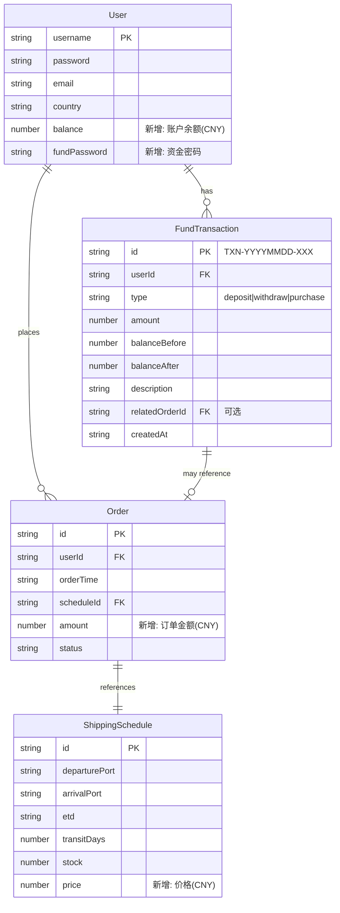
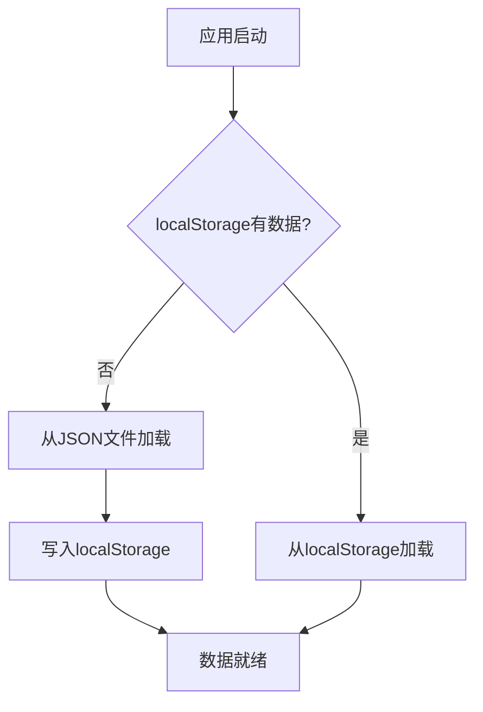
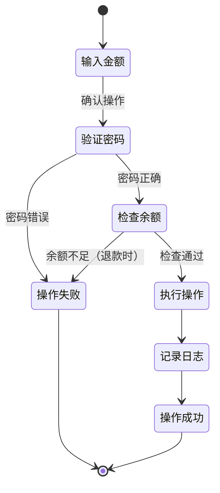
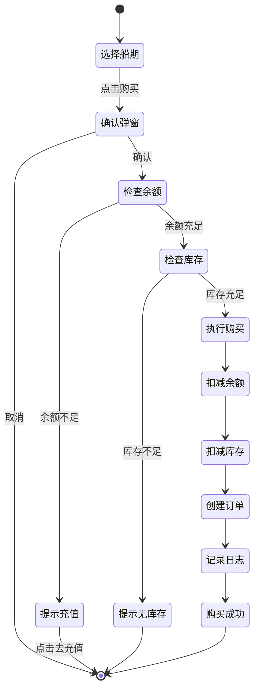

# 数据模型设计: 004-fund-stats-enhancement

**分支**: `004-fund-stats-enhancement`  
**日期**: 2026年1月12日  
**规范文件**: [spec.md](./spec.md)

---

## 1. 实体关系图



---

## 2. 实体详细定义

### 2.1 User（用户）- 扩展

**文件位置**: `src/types/user.ts`

```typescript
/**
 * 用户实体（扩展版）
 * 功能分支: 004-fund-stats-enhancement
 */
export interface User {
  /** 用户名（唯一标识），用于登录 */
  username: string
  
  /** 密码，明文存储（仅演示用途） */
  password: string
  
  /** 邮箱地址 */
  email: string
  
  /** 所在国家 */
  country: string
  
  // ============ 004-fund-stats-enhancement 新增 ============
  
  /** 账户余额（CNY），精确到分 */
  balance: number
  
  /** 资金密码，固定值"fund123"（仅演示用途） */
  fundPassword: string
}
```

**验证规则**:
- `balance`: 必须 >= 0，精确到2位小数
- `fundPassword`: 固定值，用户不可修改

---

### 2.2 FundTransaction（资金操作日志）- 新增

**文件位置**: `src/types/fund.ts`

```typescript
/**
 * 资金操作类型
 */
export type FundTransactionType = 'deposit' | 'withdraw' | 'purchase'

/**
 * 资金操作日志实体
 * 功能分支: 004-fund-stats-enhancement
 */
export interface FundTransaction {
  /** 交易ID（格式: TXN-YYYYMMDD-XXX） */
  id: string
  
  /** 用户名 */
  userId: string
  
  /** 操作类型 */
  type: FundTransactionType
  
  /** 操作金额（正数，单位: CNY） */
  amount: number
  
  /** 操作前余额 */
  balanceBefore: number
  
  /** 操作后余额 */
  balanceAfter: number
  
  /** 操作描述
   * - 充值: "充值"
   * - 退款: "退款"
   * - 消费: "购买 [起始港名]-[目的港名] 航线"
   */
  description: string
  
  /** 关联订单号（仅消费类型） */
  relatedOrderId?: string
  
  /** 创建时间（ISO 8601 格式） */
  createdAt: string
}

/**
 * 资金操作日志查询条件
 */
export interface FundTransactionQuery {
  /** 用户名 */
  userId: string
  
  /** 操作类型筛选（可选） */
  type?: FundTransactionType
  
  /** 时间范围 - 开始（可选，ISO 8601） */
  startDate?: string
  
  /** 时间范围 - 结束（可选，ISO 8601） */
  endDate?: string
}

/**
 * 资金操作日志分页结果
 */
export interface PaginatedTransactionResult {
  /** 交易记录列表 */
  transactions: FundTransaction[]
  
  /** 总记录数 */
  total: number
  
  /** 当前页码（从1开始） */
  page: number
  
  /** 每页数量 */
  pageSize: number
  
  /** 总页数 */
  totalPages: number
}
```

**ID生成规则**:
```
TXN-{YYYYMMDD}-{XXX}
示例: TXN-20260112-001
```

---

### 2.3 Order（订单）- 扩展

**文件位置**: `src/types/order.ts`

```typescript
/**
 * 订单实体（扩展版）
 * 功能分支: 003-user-booking-order, 004-fund-stats-enhancement
 */
export interface Order {
  /** 订单号 (格式: ORD-YYYYMMDD-XXX) */
  id: string
  
  /** 下单用户的用户名 */
  userId: string
  
  /** 下单时间 (ISO 8601 格式) */
  orderTime: string
  
  /** 关联的船期编号 */
  scheduleId: string
  
  /** 起运港 (完整港口信息) */
  departurePort: Port
  
  /** 目的港 (完整港口信息) */
  arrivalPort: Port
  
  /** 预计发运时间 */
  etd: string
  
  /** 预计到港时间 */
  eta: string
  
  /** 运输耗时 (天数) */
  transitDays: number
  
  /** 承运公司 */
  carrier: string
  
  /** 船名 */
  vesselName: string
  
  /** 订单状态 */
  status: OrderStatus
  
  // ============ 004-fund-stats-enhancement 新增 ============
  
  /** 订单金额（CNY），购买时的舱位价格快照 */
  amount: number
}
```

---

### 2.4 ShippingSchedule（船期）- 扩展

**文件位置**: `src/types/schedule.ts`

```typescript
/**
 * 船期实体（扩展版）
 * 功能分支: 002-shipping-schedule, 003-user-booking-order, 004-fund-stats-enhancement
 */
export interface ShippingSchedule {
  /** 唯一标识符 (格式: SCH-YYYYMMDD-XXX) */
  id: string
  
  /** 起运港代码 (关联 Port.code) */
  departurePort: string
  
  /** 目的港代码 (关联 Port.code) */
  arrivalPort: string
  
  /** 预计发运时间 (ISO 8601 日期格式) */
  etd: string
  
  /** 运输耗时 (天数) */
  transitDays: number
  
  /** 承运公司代码 */
  carrier: string
  
  /** 船名 (可选) */
  vesselName?: string
  
  /** 航次号 (可选) */
  voyageNumber?: string
  
  /** 库存数量 */
  stock?: number
  
  // ============ 004-fund-stats-enhancement 新增 ============
  
  /** 舱位价格（CNY），= transitDays * 5 */
  price: number
}
```

**价格计算规则**:
```
price = transitDays × 5
示例: transitDays=28天 → price=140 CNY
```

---

## 3. 统计相关类型

**文件位置**: `src/types/statistics.ts`

```typescript
/**
 * 时间统计维度
 */
export type TimeGranularity = 'week' | 'month'

/**
 * 时间统计数据点
 */
export interface TimeStatPoint {
  /** 时间标签（如 "2026-01" 或 "2026-W02"） */
  label: string
  
  /** 订单数量 */
  orderCount: number
  
  /** 订单金额总计（CNY） */
  totalAmount: number
}

/**
 * 时间维度统计结果
 */
export interface TimeStatistics {
  /** 统计维度 */
  granularity: TimeGranularity
  
  /** 数据点列表 */
  data: TimeStatPoint[]
  
  /** 统计时间范围 */
  range: {
    start: string
    end: string
  }
}

/**
 * 港口统计数据点
 */
export interface PortStatPoint {
  /** 港口代码 */
  portCode: string
  
  /** 港口名称 */
  portName: string
  
  /** 订单数量 */
  orderCount: number
  
  /** 订单金额总计（CNY） */
  totalAmount: number
  
  /** 占比（百分比） */
  percentage: number
}

/**
 * 港口维度统计类型
 */
export type PortStatType = 'departure' | 'arrival'

/**
 * 港口维度统计结果
 */
export interface PortStatistics {
  /** 统计类型（起始港/目的港） */
  type: PortStatType
  
  /** 数据点列表 */
  data: PortStatPoint[]
}

/**
 * 用户统计数据点
 */
export interface UserStatPoint {
  /** 用户名 */
  username: string
  
  /** 订单数量 */
  orderCount: number
  
  /** 订单金额总计（CNY） */
  totalAmount: number
  
  /** 是否为当前登录用户 */
  isCurrentUser: boolean
}

/**
 * 用户维度统计结果
 */
export interface UserStatistics {
  /** 数据点列表（按金额降序） */
  data: UserStatPoint[]
}

/**
 * 热门航线
 */
export interface HotRoute {
  /** 起始港代码 */
  departurePort: string
  
  /** 起始港名称 */
  departurePortName: string
  
  /** 目的港代码 */
  arrivalPort: string
  
  /** 目的港名称 */
  arrivalPortName: string
  
  /** 成交单数 */
  orderCount: number
}

/**
 * 热门船期统计结果
 */
export interface HotScheduleStatistics {
  /** 热门航线列表（最多3条） */
  routes: HotRoute[]
  
  /** 统计周期（最近7天） */
  period: {
    start: string
    end: string
  }
}
```

---

## 4. 初始数据更新

### 4.1 users.json 更新

**文件位置**: `src/assets/data/users.json`

```json
[
  {
    "username": "zhangsan",
    "password": "123456",
    "email": "zhangsan@example.com",
    "country": "中国",
    "balance": 0,
    "fundPassword": "fund123"
  },
  {
    "username": "john",
    "password": "123456",
    "email": "john@example.com",
    "country": "美国",
    "balance": 0,
    "fundPassword": "fund123"
  },
  {
    "username": "hans",
    "password": "123456",
    "email": "hans@example.com",
    "country": "德国",
    "balance": 0,
    "fundPassword": "fund123"
  },
  {
    "username": "lim",
    "password": "123456",
    "email": "lim@example.com",
    "country": "新加坡",
    "balance": 0,
    "fundPassword": "fund123"
  },
  {
    "username": "tanaka",
    "password": "123456",
    "email": "tanaka@example.com",
    "country": "日本",
    "balance": 0,
    "fundPassword": "fund123"
  }
]
```

### 4.2 schedules.json 更新

**文件位置**: `src/assets/data/schedules.json`

为每条船期增加 `price` 字段，计算公式: `price = transitDays * 5`

示例（第一条船期）:
```json
{
  "id": "SCH-20251215-001",
  "departurePort": "CNSHA",
  "arrivalPort": "NLRTM",
  "etd": "2025-12-15",
  "transitDays": 28,
  "carrier": "COSCO",
  "vesselName": "COSCO Shipping Leo",
  "voyageNumber": "001E",
  "stock": 99,
  "price": 140
}
```

---

## 5. 数据存储设计

### 5.1 localStorage 键设计

| 键名 | 数据类型 | 说明 |
|------|---------|------|
| `users` | `User[]` | 用户数据（含余额） |
| `orders` | `Order[]` | 订单数据（含金额） |
| `fundTransactions` | `FundTransaction[]` | 资金操作日志 |
| `schedules` | `ShippingSchedule[]` | 船期数据（含价格） |

### 5.2 数据初始化流程



---

## 6. 验证规则汇总

| 实体 | 字段 | 规则 |
|------|------|------|
| User | balance | >= 0, 精确到2位小数 |
| User | fundPassword | 固定值 "fund123" |
| FundTransaction | amount | > 0, 精确到2位小数 |
| FundTransaction | type | 枚举值: deposit/withdraw/purchase |
| Order | amount | > 0, = 关联船期的price |
| ShippingSchedule | price | = transitDays * 5, > 0 |

---

## 7. 状态转换图

### 7.1 资金操作状态流



### 7.2 购买流程状态


