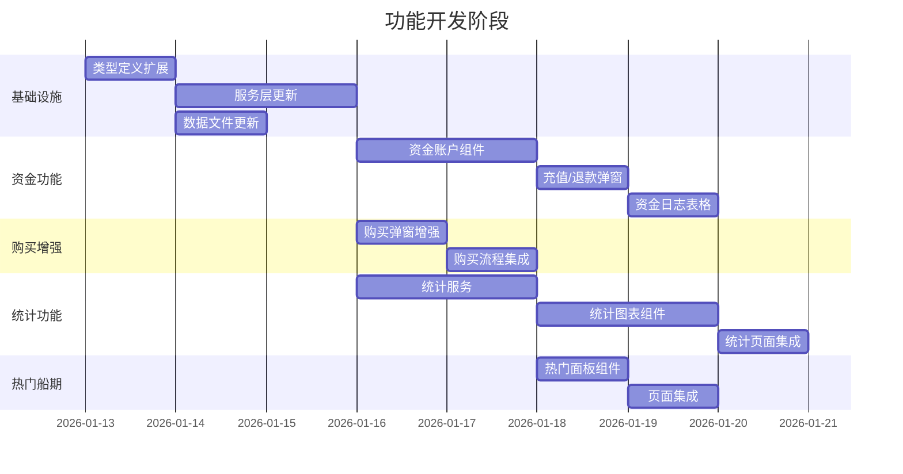

# Implementation Plan: 资金账户与统计分析增强

**Branch**: `004-fund-stats-enhancement` | **Date**: 2026-01-12 | **Spec**: [spec.md](./spec.md)
**Input**: Feature specification from `/specs/004-fund-stats-enhancement/spec.md`

**Note**: This template is filled in by the `/speckit.plan` command.

---

## Summary

本功能分支实现4大增强功能:
1. **用户资金账户管理** - 余额展示、充值、退款、资金日志
2. **完善舱位购买流程** - 价格展示、余额扣减、确认弹窗
3. **统计分析页面** - 时间/港口/用户三维度统计图表
4. **热门船期展示** - 船期查询页面右侧热门航线面板

技术方案采用 Vue 3 Composition API + TypeScript，新增 ECharts 图表库和 date-fns 日期处理库，数据持久化使用 localStorage。

---

## Technical Context

**Language/Version**: TypeScript 5.6.3 + Vue 3.5.13  
**Primary Dependencies**: Vue 3, ECharts 5.5, vue-echarts 7.0, date-fns 4.1  
**Storage**: localStorage (orders, fundTransactions, users), JSON files (ports, schedules)  
**Testing**: Vitest 2.1.8 + jsdom + @vue/test-utils  
**Target Platform**: Web Browser (Chrome, Firefox, Safari, Edge)  
**Project Type**: Single Page Application (SPA)  
**Performance Goals**: 页面加载 <1s, 图表渲染 <500ms  
**Constraints**: 纯前端演示项目，无后端 API  
**Scale/Scope**: 5个用户, ~50条船期, ~100条订单

---

## Constitution Check

*GATE: 基于 `.specify/memory/constitution.md` 验证*

### ✅ 通过的原则

| 原则 | 状态 | 说明 |
|------|------|------|
| 中文优先原则 | ✅ 通过 | 所有文档使用中文编写 |
| 可视化驱动原则 | ✅ 通过 | 使用 Mermaid 绘制 ER 图、流程图、状态图 |
| 术语统一原则 | ✅ 通过 | 术语表需更新（资金账户、交易日志等） |
| 测试先行原则 | ✅ 遵循 | 计划采用 TDD 流程开发 |
| 简约设计原则 | ✅ 通过 | 只实现当前需求，不预设后端 |

### 无违规需要说明

---

## Project Structure

### Documentation (this feature)

```text
specs/004-fund-stats-enhancement/
├── plan.md              # 本文件
├── research.md          # 技术研究 ✓
├── data-model.md        # 数据模型 ✓
├── quickstart.md        # 快速开始 ✓
├── contracts/           # 服务契约 ✓
│   ├── fund-service.ts
│   ├── statistics-service.ts
│   └── schedule-service-ext.ts
├── checklists/
│   └── requirements.md  # 需求检查清单 ✓
└── tasks.md             # 任务列表（待生成）
```

### Source Code (repository root)

```text
src/
├── assets/
│   └── data/
│       ├── users.json        # 更新: +balance, +fundPassword
│       └── schedules.json    # 更新: +price
├── components/
│   ├── FundAccountCard.vue       # 新增: 资金账户卡片
│   ├── FundDepositDialog.vue     # 新增: 充值弹窗
│   ├── FundWithdrawDialog.vue    # 新增: 退款弹窗
│   ├── FundHistoryTable.vue      # 新增: 资金日志表格
│   ├── TimeStatChart.vue         # 新增: 时间统计图表
│   ├── PortStatChart.vue         # 新增: 港口统计图表
│   ├── UserStatChart.vue         # 新增: 用户统计图表
│   ├── HotSchedulePanel.vue      # 新增: 热门船期面板
│   ├── ToastNotification.vue     # 新增: Toast 通知
│   └── PurchaseDialog.vue        # 修改: 价格展示+余额检查
├── composables/
│   ├── useFund.ts                # 新增: 资金账户组合式函数
│   ├── useStatistics.ts          # 新增: 统计分析组合式函数
│   ├── useToast.ts               # 新增: Toast 组合式函数
│   └── useAuth.ts                # 修改: 集成余额信息
├── services/
│   ├── fundService.ts            # 新增: 资金服务
│   ├── statisticsService.ts      # 新增: 统计服务
│   ├── scheduleService.ts        # 修改: 价格+库存逻辑
│   ├── orderService.ts           # 修改: 金额字段
│   └── userService.ts            # 修改: 余额+资金密码
├── types/
│   ├── fund.ts                   # 新增: 资金相关类型
│   ├── statistics.ts             # 新增: 统计相关类型
│   ├── user.ts                   # 修改: +balance, +fundPassword
│   ├── order.ts                  # 修改: +amount
│   └── schedule.ts               # 修改: +price
├── views/
│   ├── FundAccountView.vue       # 新增: 资金账户页面
│   ├── StatisticsView.vue        # 新增: 统计分析页面
│   └── ScheduleQueryView.vue     # 修改: +热门船期面板
└── App.vue                       # 修改: +导航项

tests/
├── components/
│   ├── FundAccountCard.spec.ts   # 新增
│   ├── FundDepositDialog.spec.ts # 新增
│   ├── FundHistoryTable.spec.ts  # 新增
│   ├── TimeStatChart.spec.ts     # 新增
│   ├── PortStatChart.spec.ts     # 新增
│   ├── UserStatChart.spec.ts     # 新增
│   └── HotSchedulePanel.spec.ts  # 新增
└── unit/
    ├── fundService.spec.ts       # 新增
    └── statisticsService.spec.ts # 新增
```

**Structure Decision**: 沿用现有 SPA 结构，在各层级添加新模块，保持与现有代码风格一致。

---

## Complexity Tracking

> **无违规，此表为空**

| Violation | Why Needed | Simpler Alternative Rejected Because |
|-----------|------------|-------------------------------------|
| - | - | - |

---

## Implementation Phases Overview



---

## Artifact Links

| 文档 | 路径 | 状态 |
|------|------|------|
| 规范文档 | [spec.md](./spec.md) | ✅ 完成 |
| 技术研究 | [research.md](./research.md) | ✅ 完成 |
| 数据模型 | [data-model.md](./data-model.md) | ✅ 完成 |
| 快速开始 | [quickstart.md](./quickstart.md) | ✅ 完成 |
| 服务契约 | [contracts/](./contracts/) | ✅ 完成 |
| 任务清单 | [tasks.md](./tasks.md) | ⏳ 待生成 |

---

## Next Steps

1. 运行 `/speckit.tasks` 生成详细任务清单
2. 按任务顺序开始开发
3. 每完成一个任务更新任务状态
