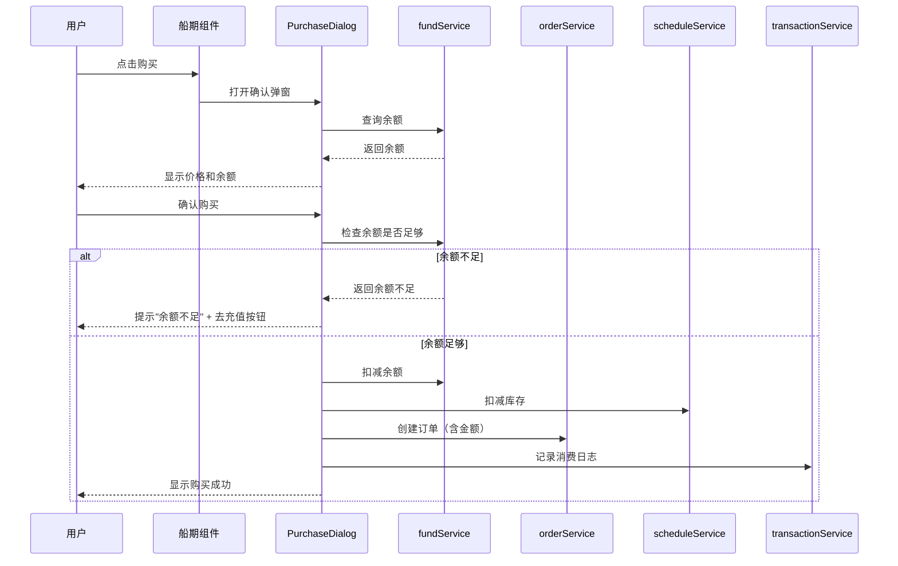

# 技术调研报告: 004-fund-stats-enhancement

**分支**: `004-fund-stats-enhancement`  
**日期**: 2026年1月12日  
**规范文件**: [spec.md](./spec.md)

## 调研概述

本文档记录了功能实现所需的技术调研结果，包括：
- 现有项目技术栈分析
- 新增技术选型决策
- 最佳实践研究
- 集成方案设计

---

## 1. 现有技术栈分析

### 1.1 核心技术

| 技术 | 版本 | 用途 |
|------|------|------|
| Vue 3 | ^3.5.13 | 前端框架，使用 Composition API |
| TypeScript | ~5.6.3 | 类型安全 |
| Vite | ^6.0.5 | 构建工具 |
| Vitest | ^2.1.8 | 单元测试框架 |

### 1.2 项目结构

```
src/
├── assets/data/          # 静态JSON数据（ports.json, schedules.json, users.json）
├── components/           # Vue组件（展示层）
├── composables/          # Vue Composables（状态逻辑复用）
├── services/             # 服务层（数据操作、业务逻辑）
├── types/                # TypeScript类型定义
└── views/                # 页面级组件
```

### 1.3 数据持久化方案

当前项目采用客户端存储方案：
- **静态数据**: JSON文件（ports.json, schedules.json, users.json）
- **动态数据**: localStorage（订单数据）
- **会话数据**: sessionStorage（登录状态）

### 1.4 状态管理

当前项目**未使用**集中式状态管理（如Pinia/Vuex），采用：
- Composables 模块级单例模式
- 响应式引用（ref/computed）跨组件共享

---

## 2. 新增技术需求分析

### 2.1 图表可视化库选型

**需求**: 统计分析页面需要展示柱状图、折线图、饼图

**候选方案**:

| 库 | 优点 | 缺点 | 推荐 |
|---|------|------|------|
| **ECharts** | 功能全面、中文友好、社区活跃 | 体积较大（约300KB gzip） | ⭐ 首选 |
| Chart.js | 轻量（约60KB）、易上手 | 中文支持弱、定制性一般 | 备选 |
| ApexCharts | 现代设计、响应式好 | 社区较小 | 不推荐 |

**决策**: 采用 **ECharts**

**理由**:
1. 中文社区活跃，文档友好（符合中文优先原则）
2. 支持所有需求的图表类型
3. 有 Vue 3 官方封装库 `vue-echarts`
4. 按需加载可优化体积

**安装命令**:
```bash
npm install echarts vue-echarts
```

### 2.2 日期处理库选型

**需求**: 按时间筛选日志、按周/月统计订单

**候选方案**:

| 库 | 优点 | 缺点 | 推荐 |
|---|------|------|------|
| **date-fns** | 轻量、Tree-shaking友好 | 函数式API学习曲线 | ⭐ 首选 |
| Day.js | 极轻量（2KB）、Moment兼容 | 功能相对简单 | 备选 |
| 原生Date | 无额外依赖 | API不友好、时区问题多 | 不推荐 |

**决策**: 采用 **date-fns**

**理由**:
1. Tree-shaking 友好，只打包使用的函数
2. 支持 `startOfWeek`, `startOfMonth`, `isWithinInterval` 等所需函数
3. TypeScript 支持完善
4. 现代化函数式API

**安装命令**:
```bash
npm install date-fns
```

### 2.3 Toast/消息提示方案

**需求**: 充值/退款成功后显示页面内消息条

**候选方案**:

| 方案 | 优点 | 缺点 | 推荐 |
|------|------|------|------|
| **自定义组件** | 完全控制、无额外依赖 | 需开发时间 | ⭐ 首选 |
| Vue Toastification | 功能完善 | 引入额外依赖 | 备选 |

**决策**: 采用**自定义 Toast 组件**

**理由**:
1. 需求简单（仅需成功/错误提示）
2. 符合简约设计原则
3. 保持依赖最小化

---

## 3. 数据模型扩展设计

### 3.1 User 类型扩展

```typescript
interface User {
  // 现有字段
  username: string
  password: string
  email: string
  country: string
  
  // 新增字段 (004-fund-stats-enhancement)
  balance: number        // 账户余额（CNY）
  fundPassword: string   // 资金密码
}
```

### 3.2 新增 FundTransaction 类型

```typescript
interface FundTransaction {
  id: string                    // TXN-YYYYMMDD-XXX
  userId: string                // 关联用户
  type: 'deposit' | 'withdraw' | 'purchase'  // 操作类型
  amount: number                // 金额（正数）
  balanceBefore: number         // 操作前余额
  balanceAfter: number          // 操作后余额
  description: string           // 操作描述
  relatedOrderId?: string       // 关联订单号（消费时）
  createdAt: string             // 操作时间（ISO 8601）
}
```

### 3.3 Order 类型扩展

```typescript
interface Order {
  // 现有字段...
  
  // 新增字段 (004-fund-stats-enhancement)
  amount: number    // 订单金额（CNY）
}
```

### 3.4 ShippingSchedule 类型扩展

```typescript
interface ShippingSchedule {
  // 现有字段...
  
  // 新增字段 (004-fund-stats-enhancement)
  price: number    // 舱位价格（CNY），= transitDays * 5
}
```

---

## 4. 服务层扩展设计

### 4.1 新增服务文件

| 文件 | 职责 |
|------|------|
| `fundService.ts` | 资金账户操作（充值、退款、余额查询） |
| `fundTransactionService.ts` | 资金操作日志管理（记录、查询、筛选） |
| `statisticsService.ts` | 订单统计（按时间、船期、用户维度） |

### 4.2 数据持久化方案

| 数据类型 | 存储方式 | 说明 |
|---------|---------|------|
| 用户余额 | localStorage | 与用户信息一同存储 |
| 资金操作日志 | localStorage | 新增 `fundTransactions` 键 |
| 订单金额 | localStorage | 扩展现有订单数据 |
| 船期价格 | JSON文件 | 更新 schedules.json |

---

## 5. 组件设计方案

### 5.1 新增页面组件

| 组件 | 路径 | 职责 |
|------|------|------|
| `FundAccountView.vue` | `views/` | 资金账户管理页面 |
| `StatisticsView.vue` | `views/` | 统计分析页面 |

### 5.2 新增功能组件

| 组件 | 路径 | 职责 |
|------|------|------|
| `FundBalance.vue` | `components/` | 余额展示区 |
| `FundOperationPanel.vue` | `components/` | 充值/退款操作区 |
| `FundPasswordDialog.vue` | `components/` | 资金密码验证弹窗 |
| `FundTransactionList.vue` | `components/` | 资金操作日志列表 |
| `FundTransactionFilter.vue` | `components/` | 日志筛选条件 |
| `QuickAmountButtons.vue` | `components/` | 快捷金额选择按钮 |
| `ToastMessage.vue` | `components/` | 消息提示组件 |
| `TimeChart.vue` | `components/` | 时间维度统计图表 |
| `PortChart.vue` | `components/` | 船期维度统计图表 |
| `UserChart.vue` | `components/` | 用户维度统计图表 |
| `HotSchedules.vue` | `components/` | 热门船期展示区 |

### 5.3 新增 Composables

| 文件 | 职责 |
|------|------|
| `useFund.ts` | 资金账户状态和操作 |
| `useFundTransactions.ts` | 资金操作日志查询 |
| `useStatistics.ts` | 统计数据计算和缓存 |
| `useHotSchedules.ts` | 热门船期计算 |
| `useToast.ts` | Toast 消息状态管理 |

---

## 6. 集成方案

### 6.1 购买流程扩展



### 6.2 导航栏扩展

当前导航项：`港口查询 | 船期查询 | 我的订单`

扩展后：`港口查询 | 船期查询 | 我的订单 | 资金账户 | 统计分析`

---

## 7. 性能考虑

### 7.1 统计数据计算

**问题**: 订单量增大时，统计计算可能变慢

**方案**:
1. 在 `useStatistics` 中使用 `computed` 缓存结果
2. 仅当依赖数据变化时重新计算
3. 若需进一步优化，可引入 Web Worker

### 7.2 ECharts 按需加载

```typescript
// 仅导入需要的图表类型
import * as echarts from 'echarts/core'
import { BarChart, LineChart, PieChart } from 'echarts/charts'
import { GridComponent, TooltipComponent, LegendComponent } from 'echarts/components'
import { CanvasRenderer } from 'echarts/renderers'

echarts.use([
  BarChart, LineChart, PieChart,
  GridComponent, TooltipComponent, LegendComponent,
  CanvasRenderer
])
```

---

## 8. 调研结论

### 8.1 最终技术决策

| 决策项 | 选择 | 理由 |
|--------|------|------|
| 图表库 | ECharts + vue-echarts | 功能全面、中文友好 |
| 日期处理 | date-fns | 轻量、Tree-shaking友好 |
| 消息提示 | 自定义组件 | 需求简单、减少依赖 |
| 状态管理 | 继续使用 Composables | 与现有架构一致 |
| 数据存储 | localStorage | 与现有方案一致 |

### 8.2 新增依赖

```json
{
  "dependencies": {
    "echarts": "^5.5.0",
    "vue-echarts": "^7.0.0",
    "date-fns": "^3.6.0"
  }
}
```

### 8.3 待澄清问题

✅ 所有技术问题已解决，无待澄清项
