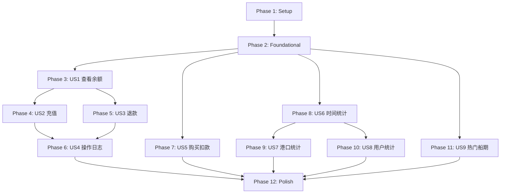

# Tasks: 资金账户与统计分析增强

**Input**: Design documents from `/specs/004-fund-stats-enhancement/`
**Prerequisites**: plan.md ✓, spec.md ✓, research.md ✓, data-model.md ✓, contracts/ ✓

**Tests**: 本项目遵循 TDD 原则，测试任务包含在各用户故事阶段中。

**Organization**: 任务按用户故事分组，支持独立实现和测试。

---

## Format: `[ID] [P?] [Story] Description`

- **[P]**: 可并行执行（不同文件，无依赖）
- **[Story]**: 任务所属用户故事（如 US1, US2...）
- 描述中包含精确文件路径

---

## Phase 1: Setup（项目基础设施）

**Purpose**: 安装新依赖、扩展类型定义

- [ ] T001 安装 ECharts 依赖: `npm install echarts vue-echarts`
- [ ] T002 安装 date-fns 依赖: `npm install date-fns`
- [ ] T003 [P] 创建资金相关类型定义 in src/types/fund.ts
- [ ] T004 [P] 创建统计相关类型定义 in src/types/statistics.ts
- [ ] T005 [P] 扩展 User 类型添加 balance, fundPassword 字段 in src/types/user.ts
- [ ] T006 [P] 扩展 Order 类型添加 amount 字段 in src/types/order.ts
- [ ] T007 [P] 扩展 ShippingSchedule 类型添加 price 字段 in src/types/schedule.ts

---

## Phase 2: Foundational（基础设施 - 阻塞性前置）

**Purpose**: 核心服务和数据更新，所有用户故事依赖此阶段

**⚠️ CRITICAL**: 用户故事开发前必须完成此阶段

- [ ] T008 更新 users.json 添加 balance(0), fundPassword("fund123") 字段 in src/assets/data/users.json
- [ ] T009 更新 schedules.json 添加 price 字段（price = transitDays * 5）in src/assets/data/schedules.json
- [ ] T010 实现 fundService 核心服务 in src/services/fundService.ts
- [ ] T011 [P] 实现 statisticsService 核心服务 in src/services/statisticsService.ts
- [ ] T012 扩展 userService 支持余额和资金密码操作 in src/services/userService.ts
- [ ] T013 扩展 scheduleService 添加价格获取和库存扣减 in src/services/scheduleService.ts
- [ ] T014 扩展 orderService 支持 amount 字段 in src/services/orderService.ts
- [ ] T015 [P] 创建 useToast 组合式函数 in src/composables/useToast.ts
- [ ] T016 [P] 创建 ToastNotification 组件 in src/components/ToastNotification.vue
- [ ] T017 配置 ECharts 全局注册 in src/main.ts

**Checkpoint**: 基础设施就绪，用户故事开发可以并行启动

---

## Phase 3: User Story 1 - 查看资金账户 (Priority: P1) 🎯 MVP

**Goal**: 用户可进入资金账户页面查看当前余额

**Independent Test**: 登录后点击"资金账户"菜单，页面显示"¥X.XX CNY"格式的余额

### Tests for User Story 1

- [ ] T018 [P] [US1] 创建 fundService 单元测试 in tests/unit/fundService.spec.ts
- [ ] T019 [P] [US1] 创建 FundAccountCard 组件测试 in tests/components/FundAccountCard.spec.ts

### Implementation for User Story 1

- [ ] T020 [US1] 创建 useFund 组合式函数（余额获取）in src/composables/useFund.ts
- [ ] T021 [US1] 创建 FundAccountCard 组件（余额展示）in src/components/FundAccountCard.vue
- [ ] T022 [US1] 创建 FundAccountView 页面 in src/views/FundAccountView.vue
- [ ] T023 [US1] 在 App.vue 添加"资金账户"导航菜单项 in src/App.vue

**Checkpoint**: 用户可查看资金账户余额

---

## Phase 4: User Story 2 - 账户充值 (Priority: P1)

**Goal**: 用户可通过资金密码验证后充值

**Independent Test**: 输入金额和资金密码，充值成功后余额增加并显示成功消息

### Tests for User Story 2

- [ ] T024 [P] [US2] 创建 FundDepositDialog 组件测试 in tests/components/FundDepositDialog.spec.ts

### Implementation for User Story 2

- [ ] T025 [US2] 扩展 useFund 添加充值功能 in src/composables/useFund.ts
- [ ] T026 [US2] 创建 FundDepositDialog 弹窗组件（金额输入+快捷按钮+密码验证）in src/components/FundDepositDialog.vue
- [ ] T027 [US2] 在 FundAccountView 集成充值弹窗 in src/views/FundAccountView.vue

**Checkpoint**: 用户可完成充值操作

---

## Phase 5: User Story 3 - 账户退款 (Priority: P1)

**Goal**: 用户可通过资金密码验证后退款

**Independent Test**: 输入金额和资金密码，退款成功后余额减少并显示成功消息

### Tests for User Story 3

- [ ] T028 [P] [US3] 创建 FundWithdrawDialog 组件测试 in tests/components/FundWithdrawDialog.spec.ts

### Implementation for User Story 3

- [ ] T029 [US3] 扩展 useFund 添加退款功能 in src/composables/useFund.ts
- [ ] T030 [US3] 创建 FundWithdrawDialog 弹窗组件（金额输入+快捷按钮+密码验证+余额检查）in src/components/FundWithdrawDialog.vue
- [ ] T031 [US3] 在 FundAccountView 集成退款弹窗 in src/views/FundAccountView.vue

**Checkpoint**: 用户可完成退款操作

---

## Phase 6: User Story 4 - 查询资金操作日志 (Priority: P2)

**Goal**: 用户可在资金账户页面查看和筛选操作日志

**Independent Test**: 资金账户页面下半部分显示操作日志列表，支持按时间和类型筛选

### Tests for User Story 4

- [ ] T032 [P] [US4] 创建 FundHistoryTable 组件测试 in tests/components/FundHistoryTable.spec.ts

### Implementation for User Story 4

- [ ] T033 [US4] 扩展 useFund 添加日志查询和筛选功能 in src/composables/useFund.ts
- [ ] T034 [US4] 创建 FundHistoryTable 组件（日志列表+筛选+分页）in src/components/FundHistoryTable.vue
- [ ] T035 [US4] 在 FundAccountView 集成日志表格 in src/views/FundAccountView.vue

**Checkpoint**: 用户可查看和筛选资金操作日志

---

## Phase 7: User Story 5 - 购买舱位扣款 (Priority: P1) 🎯 核心业务

**Goal**: 购买舱位时显示价格、检查余额、扣款并创建订单

**Independent Test**: 船期列表显示价格，购买时检查余额，成功后扣款并记录消费日志

### Tests for User Story 5

- [ ] T036 [P] [US5] 扩展 PurchaseDialog 组件测试 in tests/components/PurchaseDialog.spec.ts

### Implementation for User Story 5

- [ ] T037 [US5] 修改 ScheduleList 组件显示价格 in src/components/ScheduleList.vue
- [ ] T038 [US5] 修改 PurchaseDialog 显示价格和余额、集成余额检查 in src/components/PurchaseDialog.vue
- [ ] T039 [US5] 扩展 useScheduleSearch 集成购买扣款流程 in src/composables/useScheduleSearch.ts
- [ ] T040 [US5] 创建购买失败时"去充值"按钮跳转逻辑 in src/components/PurchaseDialog.vue

**Checkpoint**: 购买舱位流程完整，余额扣款正常

---

## Phase 8: User Story 6 - 按时间维度统计 (Priority: P2)

**Goal**: 用户可在统计分析页面按月/周查看订单统计图表

**Independent Test**: 统计分析页面显示时间维度柱状图，支持月/周切换

### Tests for User Story 6

- [ ] T041 [P] [US6] 创建 statisticsService 单元测试 in tests/unit/statisticsService.spec.ts
- [ ] T042 [P] [US6] 创建 TimeStatChart 组件测试 in tests/components/TimeStatChart.spec.ts

### Implementation for User Story 6

- [ ] T043 [US6] 创建 useStatistics 组合式函数 in src/composables/useStatistics.ts
- [ ] T044 [US6] 创建 TimeStatChart 组件（ECharts 柱状图）in src/components/TimeStatChart.vue
- [ ] T045 [US6] 创建 StatisticsView 页面骨架 in src/views/StatisticsView.vue
- [ ] T046 [US6] 在 App.vue 添加"统计分析"导航菜单项 in src/App.vue

**Checkpoint**: 时间维度统计图表可用

---

## Phase 9: User Story 7 - 按船期维度统计 (Priority: P2)

**Goal**: 用户可在统计分析页面按起始港/目的港查看订单统计图表

**Independent Test**: 统计分析页面显示港口维度饼图，支持起始港/目的港切换

### Tests for User Story 7

- [ ] T047 [P] [US7] 创建 PortStatChart 组件测试 in tests/components/PortStatChart.spec.ts

### Implementation for User Story 7

- [ ] T048 [US7] 扩展 useStatistics 添加港口统计功能 in src/composables/useStatistics.ts
- [ ] T049 [US7] 创建 PortStatChart 组件（ECharts 饼图）in src/components/PortStatChart.vue
- [ ] T050 [US7] 在 StatisticsView 集成港口统计图表 in src/views/StatisticsView.vue

**Checkpoint**: 港口维度统计图表可用

---

## Phase 10: User Story 8 - 按用户维度统计 (Priority: P2)

**Goal**: 用户可在统计分析页面查看各用户订单统计，当前用户高亮

**Independent Test**: 统计分析页面显示用户维度柱状图，当前登录用户使用不同颜色

### Tests for User Story 8

- [ ] T051 [P] [US8] 创建 UserStatChart 组件测试 in tests/components/UserStatChart.spec.ts

### Implementation for User Story 8

- [ ] T052 [US8] 扩展 useStatistics 添加用户统计功能 in src/composables/useStatistics.ts
- [ ] T053 [US8] 创建 UserStatChart 组件（ECharts 柱状图+当前用户高亮）in src/components/UserStatChart.vue
- [ ] T054 [US8] 在 StatisticsView 集成用户统计图表 in src/views/StatisticsView.vue

**Checkpoint**: 用户维度统计图表可用，当前用户高亮

---

## Phase 11: User Story 9 - 热门船期展示 (Priority: P2)

**Goal**: 船期查询页面右侧显示热门航线面板

**Independent Test**: 船期查询页面右侧显示"热门船期"区域，展示最近7天成交最多的3条航线

### Tests for User Story 9

- [ ] T055 [P] [US9] 创建 HotSchedulePanel 组件测试 in tests/components/HotSchedulePanel.spec.ts

### Implementation for User Story 9

- [ ] T056 [US9] 创建 HotSchedulePanel 组件 in src/components/HotSchedulePanel.vue
- [ ] T057 [US9] 修改 ScheduleQueryView 布局添加热门船期面板 in src/views/ScheduleQueryView.vue
- [ ] T058 [US9] 实现热门船期点击自动填充查询条件功能 in src/views/ScheduleQueryView.vue

**Checkpoint**: 热门船期面板展示并可交互

---

## Phase 12: Polish & Cross-Cutting Concerns

**Purpose**: 跨故事优化和收尾工作

- [ ] T059 [P] 运行所有测试确保通过: `npm run test`
- [ ] T060 [P] 类型检查: `npm run type-check`
- [ ] T061 代码清理和重构（移除 console.log，统一命名）
- [ ] T062 验证 quickstart.md 中的开发流程
- [ ] T063 更新术语表 in .specify/memory/glossary.md

---

## Dependencies & Execution Order

### Phase Dependencies



### User Story Dependencies

- **US1 (查看余额)**: 依赖 Foundational 完成，无其他故事依赖
- **US2 (充值)**: 依赖 US1 完成
- **US3 (退款)**: 依赖 US1 完成
- **US4 (操作日志)**: 依赖 US2, US3 完成（需要日志数据）
- **US5 (购买扣款)**: 依赖 Foundational 完成，可与 US1 并行
- **US6 (时间统计)**: 依赖 Foundational 完成，可与资金功能并行
- **US7 (港口统计)**: 依赖 US6 完成（共享 StatisticsView）
- **US8 (用户统计)**: 依赖 US6 完成（共享 StatisticsView）
- **US9 (热门船期)**: 依赖 Foundational 完成，可独立开发

### Within Each User Story

- Tests MUST be written and FAIL before implementation
- Services before composables
- Composables before components
- Components before views
- Core implementation before integration

### Parallel Opportunities

```text
# Phase 1 并行:
T003, T004, T005, T006, T007 可同时执行

# Phase 2 并行:
T010 + T011 可同时执行
T015 + T016 可同时执行

# Foundational 完成后可并行启动:
US1 (资金账户) ← 与 → US5 (购买扣款)
US6/7/8 (统计功能) ← 与 → US9 (热门船期)
```

---

## Parallel Example: Setup Phase

```bash
# Launch all type definitions together:
Task T003: "创建资金相关类型定义 in src/types/fund.ts"
Task T004: "创建统计相关类型定义 in src/types/statistics.ts"
Task T005: "扩展 User 类型 in src/types/user.ts"
Task T006: "扩展 Order 类型 in src/types/order.ts"
Task T007: "扩展 ShippingSchedule 类型 in src/types/schedule.ts"
```

---

## Implementation Strategy

### MVP First (US1 + US5)

1. Complete Phase 1: Setup
2. Complete Phase 2: Foundational (CRITICAL)
3. Complete Phase 3: US1 查看资金账户
4. Complete Phase 7: US5 购买舱位扣款
5. **STOP and VALIDATE**: 验证资金账户余额显示、购买扣款流程
6. Deploy/Demo MVP

### Incremental Delivery

1. Setup + Foundational → 基础设施就绪
2. US1 + US2 + US3 → 资金充值/退款可用 → Demo
3. US4 → 操作日志可查 → Demo
4. US5 → 购买扣款完整 → Demo (核心业务闭环)
5. US6 + US7 + US8 → 统计分析页面 → Demo
6. US9 → 热门船期 → Demo
7. Polish → 发布就绪

### Parallel Team Strategy

With 2 developers:

```text
Developer A: 资金功能线
  US1 → US2 → US3 → US4 → US5

Developer B: 统计功能线
  US6 → US7 → US8 → US9
```

---

## Summary

| Phase | Description | Task Count |
|-------|-------------|------------|
| 1 | Setup | 7 |
| 2 | Foundational | 10 |
| 3 | US1 查看资金账户 | 6 |
| 4 | US2 账户充值 | 4 |
| 5 | US3 账户退款 | 4 |
| 6 | US4 资金操作日志 | 4 |
| 7 | US5 购买舱位扣款 | 5 |
| 8 | US6 时间维度统计 | 6 |
| 9 | US7 港口维度统计 | 4 |
| 10 | US8 用户维度统计 | 4 |
| 11 | US9 热门船期展示 | 4 |
| 12 | Polish | 5 |
| **Total** | | **63** |

---

## Notes

- [P] 标记的任务可并行执行（不同文件，无依赖）
- [Story] 标签将任务映射到用户故事，便于追溯
- 每个用户故事应可独立完成和测试
- 先验证测试失败，再实现功能
- 每个任务或逻辑组完成后提交
- 在任何检查点停下来验证故事功能
- 避免：模糊任务、同文件冲突、破坏独立性的跨故事依赖
